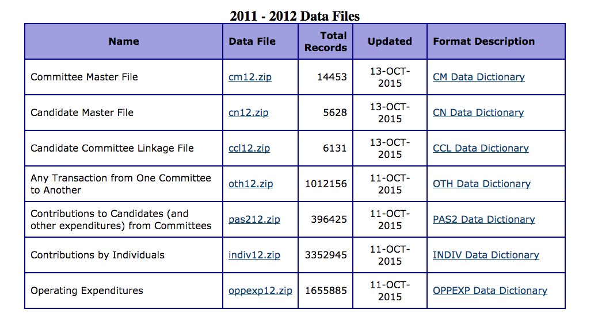
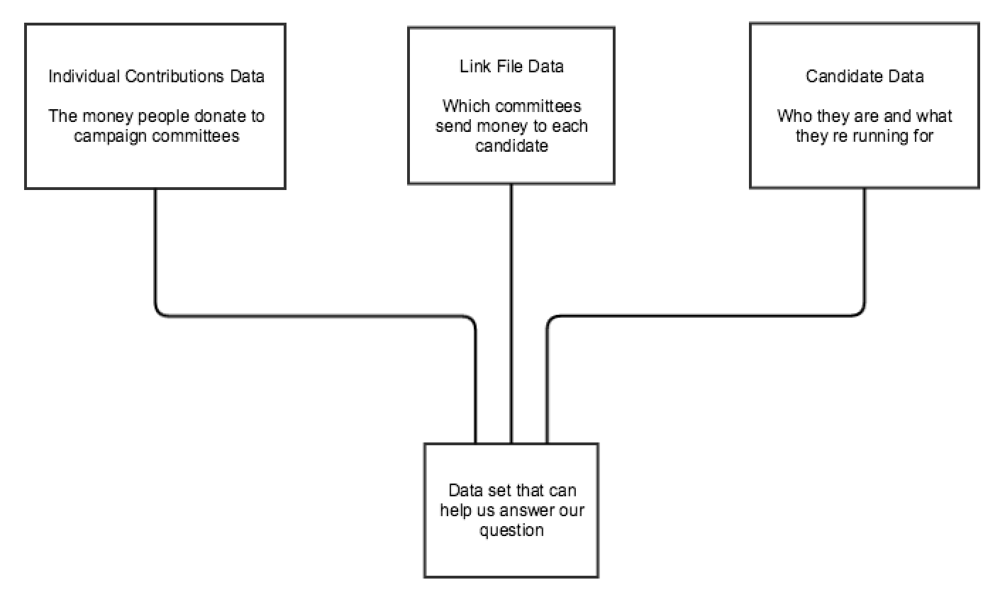
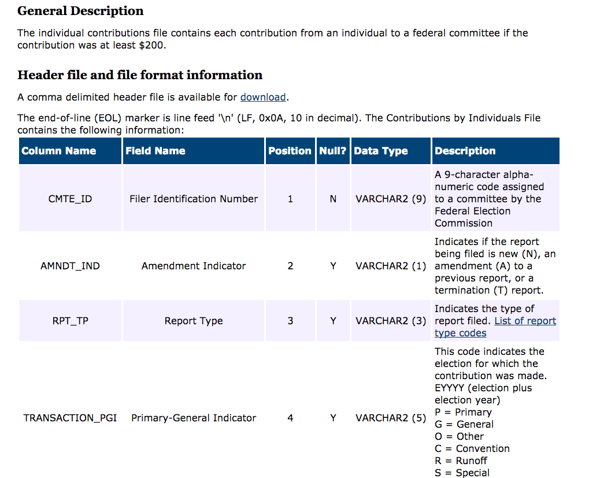
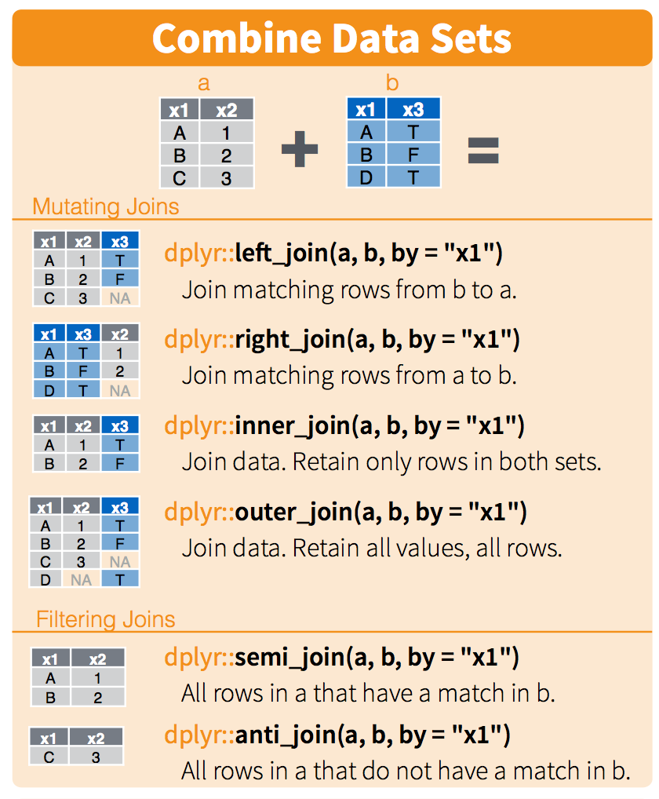
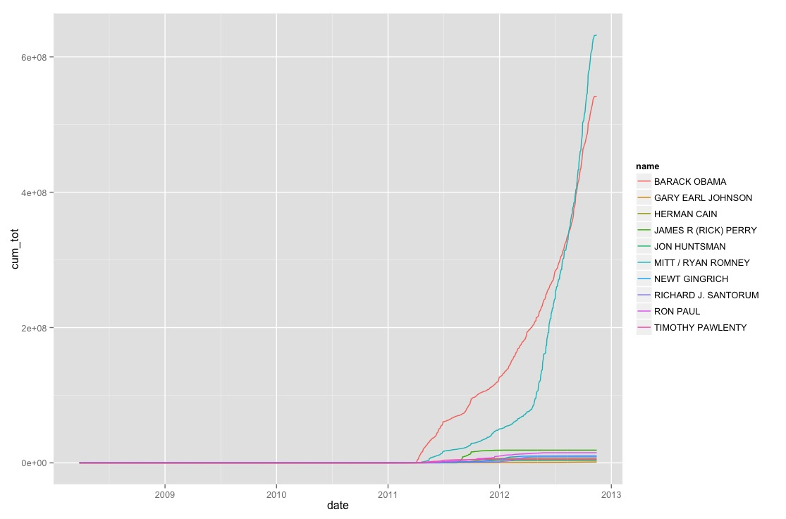
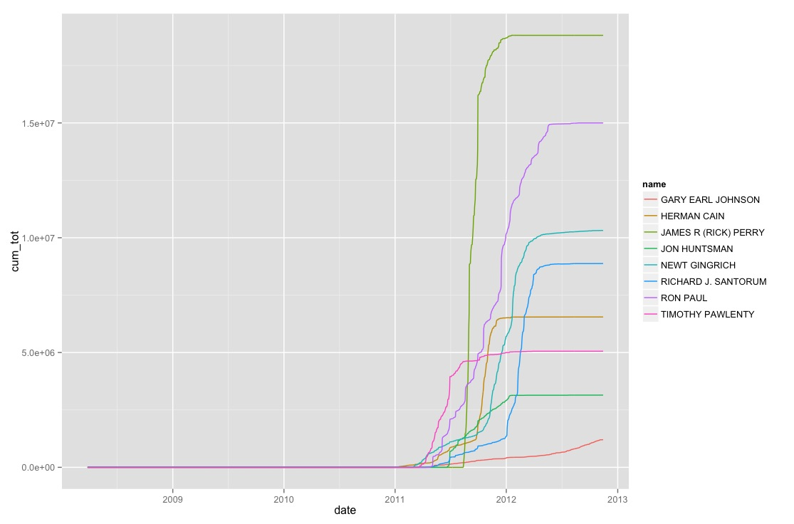

```{r setup, include=FALSE}
knitr::opts_chunk$set(echo = FALSE)
```


What is it?
========================================================

<big>Data munging or data wrangling is the process of manually converting data from one "raw" form into another format that allows for more convenient consumption of the data.</big>


The hidden aspect of Analytics
========================================================

Predictive Analytics requires

1. Data Persistence to house data
2. Data Science to correctly answer questions
3. Data Products to visualize and consume results
4. Data Munging so that all the above are possible


Why, you ask?
========================================================

- Data NEVER comes in the CORRECT format
- Data was collected for a DIFFERENT purpose
- Data comes from DISPERATE places
- Data CHANGES over time
- Data always has ERRORS in it


Data Janitor, the unsung hero of Data Science
========================================================

This takes up roughly 80% of time/effort

You could double your time spent on analytics by reducing time on cleaning by only a quarter!


Pipes (brief detour)
========================================================

- It is easier to munge data if we think in steps
- Using the pipe (%>%) construct helps
- Allows for left-to-right (not from the inside and out)
- make it easy to add steps anywhere in the sequence


Which is more readable
========================================================


```r
bop_on(scoop_up(hop_through(foo_foo, forest), field_mouse), head)
```

or


```r
foo_foo %>%
  hop_through(forest) %>%
  scoop_up(field_mouse) %>%
  bop_on(head)
```


Setup
========================================================


```r
options(stringsAsFactors = FALSE)
library(dplyr)
library(lubridate)
library(purrr)
library(ggplot2)
library(stringr)
```


Where do we start?
========================================================

Always start with a question!

Which presidential candidate made more money?


The Data
========================================================



The real view
========================================================




What does any of it mean
========================================================




Load Individual Donations
========================================================


```r
ind <- read.csv('indiv12.txt', sep = '|', 
                skipNul = T, na.strings = '', 
                header = F, quote = "")
```


```
         V1 V2 V3   V4          V5 V6  V7                        V8
1 C00114132  A M2 <NA> 11930476682 15 IND     DAVIS, KAREN LEIGH DR
2 C00114132  A M2 <NA> 11930476682 15 IND HOLLAND, MARK ROBERSON DR
3 C00114132  A M2 <NA> 11930476682 15 IND  RICHARDS, GEORGE E DR JR
4 C00114132  A M2 <NA> 11930476683 15 IND       KRAFT, WALLACE E DR
5 C00114132  A M2 <NA> 11930476683 15 IND     BROWN, GARY STEVEN DR
6 C00114132  A M2 <NA> 11930476683 15 IND        DEE, LARRY GENE DR
              V9 V10   V11                         V12          V13
1 HENDERSONVILLE  NC 28791 NORTH STATE ANIMAL HOSPITAL VETERINARIAN
2         PURVIS  MS 39475 HOLLAND VETERINARY HOSPITAL VETERINARIAN
3       DANVILLE  IL 61834                VETERINARIAN VETERINARIAN
4          PARIS  TX 75462        ANIMAL HEALTH CENTER VETERINARIAN
5      PRINCETON  WV 24740          ANIMAL CARE CENTER VETERINARIAN
6      HOLLYWOOD  FL 33021   HOLLYWOOD ANIMAL HOSPITAL VETERINARIAN
      V14  V15  V16      V17    V18  V19  V20         V21
1 1052011  550 <NA> 32812936 716867 <NA> <NA> 4.03152e+18
2 1032011  535 <NA> 32812937 716867 <NA> <NA> 4.03152e+18
3 1052011  535 <NA> 32812938 716867 <NA> <NA> 4.03152e+18
4 1052011  250 <NA> 32812939 716867 <NA> <NA> 4.03152e+18
5 1112011 5000 <NA> 32836411 716867 <NA> <NA> 4.03152e+18
6 1112011 5000 <NA> 32836420 716867 <NA> <NA> 4.03152e+18
```

The data has no names
========================================================


```r
names(ind) <- names(read.csv('indiv_header_file.csv'))
```


```
    CMTE_ID AMNDT_IND RPT_TP TRANSACTION_PGI   IMAGE_NUM TRANSACTION_TP
1 C00114132         A     M2            <NA> 11930476682             15
2 C00114132         A     M2            <NA> 11930476682             15
3 C00114132         A     M2            <NA> 11930476682             15
4 C00114132         A     M2            <NA> 11930476683             15
5 C00114132         A     M2            <NA> 11930476683             15
6 C00114132         A     M2            <NA> 11930476683             15
  ENTITY_TP                      NAME           CITY STATE ZIP_CODE
1       IND     DAVIS, KAREN LEIGH DR HENDERSONVILLE    NC    28791
2       IND HOLLAND, MARK ROBERSON DR         PURVIS    MS    39475
3       IND  RICHARDS, GEORGE E DR JR       DANVILLE    IL    61834
4       IND       KRAFT, WALLACE E DR          PARIS    TX    75462
5       IND     BROWN, GARY STEVEN DR      PRINCETON    WV    24740
6       IND        DEE, LARRY GENE DR      HOLLYWOOD    FL    33021
                     EMPLOYER   OCCUPATION TRANSACTION_DT TRANSACTION_AMT
1 NORTH STATE ANIMAL HOSPITAL VETERINARIAN        1052011             550
2 HOLLAND VETERINARY HOSPITAL VETERINARIAN        1032011             535
3                VETERINARIAN VETERINARIAN        1052011             535
4        ANIMAL HEALTH CENTER VETERINARIAN        1052011             250
5          ANIMAL CARE CENTER VETERINARIAN        1112011            5000
6   HOLLYWOOD ANIMAL HOSPITAL VETERINARIAN        1112011            5000
  OTHER_ID  TRAN_ID FILE_NUM MEMO_CD MEMO_TEXT      SUB_ID
1     <NA> 32812936   716867    <NA>      <NA> 4.03152e+18
2     <NA> 32812937   716867    <NA>      <NA> 4.03152e+18
3     <NA> 32812938   716867    <NA>      <NA> 4.03152e+18
4     <NA> 32812939   716867    <NA>      <NA> 4.03152e+18
5     <NA> 32836411   716867    <NA>      <NA> 4.03152e+18
6     <NA> 32836420   716867    <NA>      <NA> 4.03152e+18
```


Select
========================================================
Decrease the width of your data

```r
ind %>% 
  select(CMTE_ID, TRANSACTION_TP, ENTITY_TP, 
         TRANSACTION_DT, TRANSACTION_AMT) -> ind
```

```
    CMTE_ID TRANSACTION_TP ENTITY_TP TRANSACTION_DT TRANSACTION_AMT
1 C00114132             15       IND        1052011             550
2 C00114132             15       IND        1032011             535
3 C00114132             15       IND        1052011             535
4 C00114132             15       IND        1052011             250
5 C00114132             15       IND        1112011            5000
6 C00114132             15       IND        1112011            5000
```


Filter
========================================================
Decrease the height of your data

```r
ind %>% 
  filter(TRANSACTION_TP == '15') %>% 
  select(-TRANSACTION_TP) -> ind
```

```
    CMTE_ID ENTITY_TP TRANSACTION_DT TRANSACTION_AMT
1 C00114132       IND        1052011             550
2 C00114132       IND        1032011             535
3 C00114132       IND        1052011             535
4 C00114132       IND        1052011             250
5 C00114132       IND        1112011            5000
6 C00114132       IND        1112011            5000
```


The process
========================================================

- Load Data
- Give it correct names
- Select fields (columns) we need
- Filter rows (observations) that are relevant
- Rinse and repeat for other data sets


Remove code noise
========================================================

```r
add_names <- function(df, file) {
  names(df) <- names(read.csv(file))
  df
}

read_fec <- function(file) {
  read.csv(file, sep = '|', skipNul = T, na.strings = '', 
           header = F, quote = "")
}
```


Candidate Data
========================================================


```r
'cn12.txt' %>%
  read_fec %>%
  add_names('cn_header_file.csv') %>%
  select(CAND_ID, CAND_NAME, CAND_ELECTION_YR, CAND_OFFICE) %>% 
  filter(CAND_OFFICE == 'P')  %>%
  select(-CAND_OFFICE) -> cand
```


```
    CAND_ID                 CAND_NAME CAND_ELECTION_YR
1 P00000133  MCDANIELS, EDISON PENROW             2008
2 P00000679       CARROLL, JERRY LEON             2012
3 P00000729   MUZYK, GEORGE ALEXANDER             2000
4 P00001792      ENGLERIUS, MAXIMUS T             2012
5 P00002295      BYERLEY, LESTER F JR             2012
6 P00002568 LEVINSON, MICHAEL STEPHEN             2012
```


Link Data
========================================================


```r
'ccl12.txt' %>%
  read_fec %>%
  add_names('ccl_header_file.csv') %>%
  select(CAND_ID, CAND_ELECTION_YR, CMTE_ID) -> link
```

```
    CAND_ID CAND_ELECTION_YR   CMTE_ID
1 H0AK00089             2010 C00466698
2 H0AK00097             2012 C00525261
3 H0AL00016             2012 C00464040
4 H0AL01030             2012 C00459495
5 H0AL02087             2012 C00493783
6 H0AL02087             2012 C00488874
```


Joins
========================================================

How do we turn three data sets into one?



Joins
========================================================

This will increase the width of the data


```r
cand %>% 
  inner_join(link, by = c("CAND_ID", "CAND_ELECTION_YR")) -> df 
```

```
    CAND_ID                CAND_NAME CAND_ELECTION_YR   CMTE_ID
1 P00000133 MCDANIELS, EDISON PENROW             2008 C00442582
2 P00000679      CARROLL, JERRY LEON             2012 C00214999
3 P00000729  MUZYK, GEORGE ALEXANDER             2000 C00283325
4 P00002295     BYERLEY, LESTER F JR             2012 C00497636
5 P00003186    THOMPSON, FRED DALTON             2008 C00436261
6 P00003236          PRATTAS, JAMES              2012 C00497107
```

Joins
========================================================


```r
df %>% 
  inner_join(ind, by = "CMTE_ID") -> df
```

```
    CAND_ID               CAND_NAME CAND_ELECTION_YR   CMTE_ID ENTITY_TP
1 P00003392 CLINTON, HILLARY RODHAM             2008 C00431569       IND
2 P00003392 CLINTON, HILLARY RODHAM             2008 C00431569       IND
3 P00003392 CLINTON, HILLARY RODHAM             2008 C00431569       IND
4 P00003392 CLINTON, HILLARY RODHAM             2008 C00431569       IND
5 P00003392 CLINTON, HILLARY RODHAM             2008 C00431569       IND
6 P00003392 CLINTON, HILLARY RODHAM             2008 C00431569       IND
  TRANSACTION_DT TRANSACTION_AMT
1        2082011            -250
2        2082011             250
3        1112011             300
4        1112011             700
5        1062011             500
6        2052011            -250
```

Cleanup
========================================================


```r
df %>% 
  select(-CAND_ID, -CMTE_ID) -> df
```

```
                CAND_NAME CAND_ELECTION_YR ENTITY_TP TRANSACTION_DT
1 CLINTON, HILLARY RODHAM             2008       IND        2082011
2 CLINTON, HILLARY RODHAM             2008       IND        2082011
3 CLINTON, HILLARY RODHAM             2008       IND        1112011
4 CLINTON, HILLARY RODHAM             2008       IND        1112011
5 CLINTON, HILLARY RODHAM             2008       IND        1062011
6 CLINTON, HILLARY RODHAM             2008       IND        2052011
  TRANSACTION_AMT
1            -250
2             250
3             300
4             700
5             500
6            -250
```


Missing values
========================================================

```r
df %>% filter(is.na(TRANSACTION_DT))
```

```
                      CAND_NAME CAND_ELECTION_YR ENTITY_TP TRANSACTION_DT
1 ROMNEY, MITT / RYAN, PAUL D.              2012      <NA>             NA
2 ROMNEY, MITT / RYAN, PAUL D.              2012       IND             NA
  TRANSACTION_AMT
1             250
2             250
```


Date is not really date
========================================================

```r
str(df)
```

```
'data.frame':	1125121 obs. of  5 variables:
 $ CAND_NAME       : chr  "CLINTON, HILLARY RODHAM" "CLINTON, HILLARY RODHAM" "CLINTON, HILLARY RODHAM" "CLINTON, HILLARY RODHAM" ...
 $ CAND_ELECTION_YR: int  2008 2008 2008 2008 2008 2008 2008 2008 2008 2008 ...
 $ ENTITY_TP       : chr  "IND" "IND" "IND" "IND" ...
 $ TRANSACTION_DT  : int  2082011 2082011 1112011 1112011 1062011 2052011 2052011 6132011 6082011 6102011 ...
 $ TRANSACTION_AMT : int  -250 250 300 700 500 -250 250 200 250 250 ...
```


Mutate to the Rescue
========================================================


```r
df %>%
  filter(!is.na(TRANSACTION_DT)) %>%
  mutate(date = as.Date(mdy(TRANSACTION_DT))) %>%
  select(-TRANSACTION_DT) -> df
```

```
                CAND_NAME CAND_ELECTION_YR ENTITY_TP TRANSACTION_AMT
1 CLINTON, HILLARY RODHAM             2008       IND            -250
2 CLINTON, HILLARY RODHAM             2008       IND             250
3 CLINTON, HILLARY RODHAM             2008       IND             300
4 CLINTON, HILLARY RODHAM             2008       IND             700
5 CLINTON, HILLARY RODHAM             2008       IND             500
6 CLINTON, HILLARY RODHAM             2008       IND            -250
        date
1 2011-02-08
2 2011-02-08
3 2011-01-11
4 2011-01-11
5 2011-01-06
6 2011-02-05
```


Too verbose
========================================================


```r
df %>% 
  rename(  name = CAND_NAME, 
         amount = TRANSACTION_AMT,
           type = ENTITY_TP,
           year = CAND_ELECTION_YR) -> df
```

```
                     name year type amount       date
1 CLINTON, HILLARY RODHAM 2008  IND   -250 2011-02-08
2 CLINTON, HILLARY RODHAM 2008  IND    250 2011-02-08
3 CLINTON, HILLARY RODHAM 2008  IND    300 2011-01-11
4 CLINTON, HILLARY RODHAM 2008  IND    700 2011-01-11
5 CLINTON, HILLARY RODHAM 2008  IND    500 2011-01-06
6 CLINTON, HILLARY RODHAM 2008  IND   -250 2011-02-05
```


Names look pretty rough
========================================================


```r
df$name %>%
  str_split(", ") %>% 
  map_chr(~ paste(.[[2]], .[[1]])) -> df$name
```

```
                    name year type amount       date
1 HILLARY RODHAM CLINTON 2008  IND   -250 2011-02-08
2 HILLARY RODHAM CLINTON 2008  IND    250 2011-02-08
3 HILLARY RODHAM CLINTON 2008  IND    300 2011-01-11
4 HILLARY RODHAM CLINTON 2008  IND    700 2011-01-11
5 HILLARY RODHAM CLINTON 2008  IND    500 2011-01-06
6 HILLARY RODHAM CLINTON 2008  IND   -250 2011-02-05
```


Just one election
========================================================


```r
df %>% 
  filter(year == 2012) %>% 
  select(-year) -> df
```

```
         name type amount       date
1 HERMAN CAIN  IND    250 2011-10-31
2 HERMAN CAIN  IND    250 2011-11-01
3 HERMAN CAIN  IND    500 2011-10-26
4 HERMAN CAIN  IND    250 2011-10-25
5 HERMAN CAIN  IND   1000 2011-11-02
6 HERMAN CAIN  IND    250 2011-10-28
```


Only People
========================================================


```r
df %>% 
  filter(type %in% c('IND', 'CAN')) %>%
  select(-type) -> df
```

```
         name amount       date
1 HERMAN CAIN    250 2011-10-31
2 HERMAN CAIN    250 2011-11-01
3 HERMAN CAIN    500 2011-10-26
4 HERMAN CAIN    250 2011-10-25
5 HERMAN CAIN   1000 2011-11-02
6 HERMAN CAIN    250 2011-10-28
```


Who?
========================================================


```r
df %>% 
  group_by(name) %>% 
  summarise(obs = n()) -> popular
```

```
                              name    obs
1                     BARACK OBAMA 598632
2  CHARLES E. ''BUDDY'' III ROEMER     11
3      CHRISTINA (VICE PRES) LOPEZ     28
4                   EDGAR A LAWSON      2
5                      FRED KARGER     93
6                GARY EARL JOHNSON   1887
7                      HERMAN CAIN  11713
8             JAMES R (RICK) PERRY  12079
9                JARED BLANKENSHIP     50
10                   JILL ANN REED     24
11                      JILL STEIN    872
12              JOHN DAVIS HAYWOOD      1
13                    JON HUNTSMAN   3042
14                 L JOHN JR DAVIS     10
15              MITT / RYAN ROMNEY 417746
16                   NEWT GINGRICH  19027
17                 RANDALL A TERRY    341
18             RICHARD J. SANTORUM  16575
19      RICHARDJASON SATAWK HARRIS     18
20                        RON PAUL  38477
21                   ROSEANNE BARR      5
22                  STEPHEN DURHAM     28
23             THADDEUS G MCCOTTER     34
24                TIMOTHY PAWLENTY   3831
25                 VERL FARNSWORTH      5
```

Who?
========================================================

```r
popular %>% top_n(10, obs) -> most_popular
```

```
                   name    obs
1          BARACK OBAMA 598632
2     GARY EARL JOHNSON   1887
3           HERMAN CAIN  11713
4  JAMES R (RICK) PERRY  12079
5          JON HUNTSMAN   3042
6    MITT / RYAN ROMNEY 417746
7         NEWT GINGRICH  19027
8   RICHARD J. SANTORUM  16575
9              RON PAUL  38477
10     TIMOTHY PAWLENTY   3831
```


Not Everybody
========================================================


```r
df %>% 
  semi_join(most_popular, by = 'name') -> df
```

```
          name amount       date
1 BARACK OBAMA   5000 2011-11-19
2 BARACK OBAMA    500 2011-10-04
3 BARACK OBAMA  30800 2011-12-31
4 BARACK OBAMA  10000 2011-10-26
5 BARACK OBAMA  10000 2011-11-22
6 BARACK OBAMA    250 2011-11-03
```


Back to the Future
========================================================


```r
df %>% 
  filter(date < as.Date(mdy('11152012'))) -> df
```

```
          name amount       date
1 BARACK OBAMA   5000 2011-11-19
2 BARACK OBAMA    500 2011-10-04
3 BARACK OBAMA  30800 2011-12-31
4 BARACK OBAMA  10000 2011-10-26
5 BARACK OBAMA  10000 2011-11-22
6 BARACK OBAMA    250 2011-11-03
```


From average people
========================================================


```r
df %>% 
  filter(abs(amount) < 100000) -> df
```

```
          name amount       date
1 BARACK OBAMA   5000 2011-11-19
2 BARACK OBAMA    500 2011-10-04
3 BARACK OBAMA  30800 2011-12-31
4 BARACK OBAMA  10000 2011-10-26
5 BARACK OBAMA  10000 2011-11-22
6 BARACK OBAMA    250 2011-11-03
```

Aggregations
========================================================


```r
df %>% 
  group_by(name, date) %>%
  summarise(total = sum(amount)) -> df
```

```
Source: local data frame [6 x 3]
Groups: name

          name       date   total
         (chr)     (date)   (int)
1 BARACK OBAMA 2011-04-04 1194427
2 BARACK OBAMA 2011-04-05  822770
3 BARACK OBAMA 2011-04-06  919561
4 BARACK OBAMA 2011-04-07  823532
5 BARACK OBAMA 2011-04-08 1168861
6 BARACK OBAMA 2011-04-09  228749
```


Add in missing days
========================================================


```r
allDates <- 
  data.frame(date = as.Date(min(df$date) : max(df$date), 
                            origin = origin))

df %>% 
  split(.$name) %>%
  map( ~ full_join(., cbind(allDates, name = .$name[1]), 
                   by = c("name", "date"))) %>%
  bind_rows %>%
  arrange(name, date) -> df
```

```
Source: local data frame [6 x 3]

          name       date total
         (chr)     (date) (int)
1 BARACK OBAMA 2008-03-27    NA
2 BARACK OBAMA 2008-03-28    NA
3 BARACK OBAMA 2008-03-29    NA
4 BARACK OBAMA 2008-03-30    NA
5 BARACK OBAMA 2008-03-31    NA
6 BARACK OBAMA 2008-04-01    NA
```


Zero 
========================================================


```r
df$total <- ifelse(is.na(df$total), 0, df$total)
```

```
Source: local data frame [6 x 3]

          name       date total
         (chr)     (date) (dbl)
1 BARACK OBAMA 2008-03-27     0
2 BARACK OBAMA 2008-03-28     0
3 BARACK OBAMA 2008-03-29     0
4 BARACK OBAMA 2008-03-30     0
5 BARACK OBAMA 2008-03-31     0
6 BARACK OBAMA 2008-04-01     0
```

Order them
========================================================


```r
df %>% 
  arrange(name, date) -> df
```

```
Source: local data frame [6 x 3]

          name       date total
         (chr)     (date) (dbl)
1 BARACK OBAMA 2008-03-27     0
2 BARACK OBAMA 2008-03-28     0
3 BARACK OBAMA 2008-03-29     0
4 BARACK OBAMA 2008-03-30     0
5 BARACK OBAMA 2008-03-31     0
6 BARACK OBAMA 2008-04-01     0
```


Running total
========================================================


```r
df %>% 
  group_by(name) %>%
  mutate(cum_tot = cumsum(total)) -> tot
```

```
Source: local data frame [6 x 4]
Groups: name

          name       date total cum_tot
         (chr)     (date) (dbl)   (dbl)
1 BARACK OBAMA 2008-03-27     0       0
2 BARACK OBAMA 2008-03-28     0       0
3 BARACK OBAMA 2008-03-29     0       0
4 BARACK OBAMA 2008-03-30     0       0
5 BARACK OBAMA 2008-03-31     0       0
6 BARACK OBAMA 2008-04-01     0       0
```


Result
========================================================


```r
ggplot(tot, aes(x = date, y = cum_tot, 
                color = name, group = name)) + geom_line()
```




Total Money
========================================================


```r
tot %>% 
  group_by(name) %>%
  summarise(max = max(cum_tot)) %>%
  arrange(desc(max)) -> totals
```

```
Source: local data frame [10 x 2]

                   name       max
                  (chr)     (dbl)
1    MITT / RYAN ROMNEY 632468656
2          BARACK OBAMA 541859246
3  JAMES R (RICK) PERRY  18817834
4              RON PAUL  14998597
5         NEWT GINGRICH  10317229
6   RICHARD J. SANTORUM   8875965
7           HERMAN CAIN   6548949
8      TIMOTHY PAWLENTY   5057130
9          JON HUNTSMAN   3145329
10    GARY EARL JOHNSON   1202470
```


Modified Result
========================================================


```r
tot %>% 
  anti_join(totals %>% top_n(2, max), by = 'name') %>%
  ggplot(aes(x = date, y = cum_tot, 
             color = name, group = name)) +
  geom_line()
```




What did we answer
========================================================

We changed the question quite a bit.

Which presidential candidate made more money?

Of the popular candidates in the 2012 Presidential Election, who received the most contributions from average people using observations that made temporal sense.

For some definition of the words popular and average.
