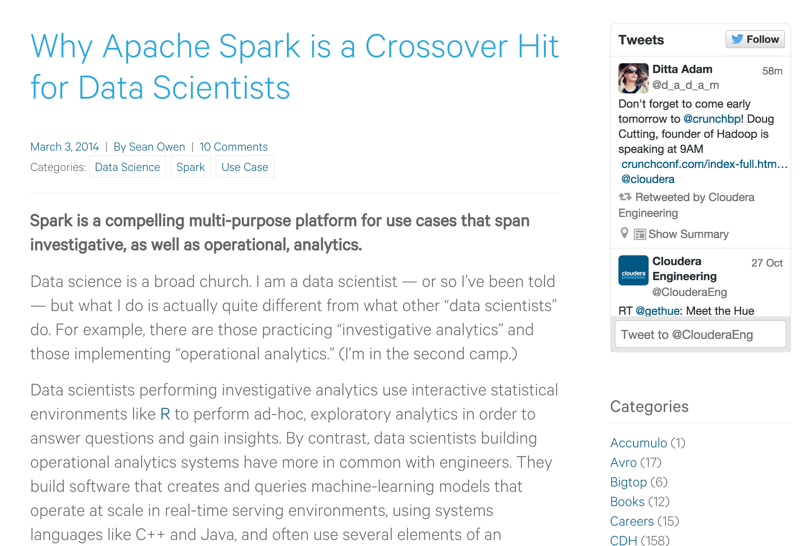

This material is from a month of lectures I used at Georgetown University for a graduate statistical programming course. I have read through plenty of tutorials and many have fallen out of date or been for setups that were quite different than mine. I am sure that since Spark has had a few new versions since most this was written that it will not work perfectly either. This will hopefully serve two purposes, point to sources that have some useful info on Spark and a place to store some of the useful commands I needed to get Spark to do real work. Spark and AWS are not the easyist peices of tech to work with. I have tried to work through many tutorials and most of them have an issue somewhere, this will not succeed where others have failed though.


### Motivating Example

To get started, a motivating example. [Flight data](http://stat-computing.org/dataexpo/2009/the-data.html) from roughly 20 years.


```{r}
options(stringsAsFactors = FALSE)
library(dplyr)
library(lubridate)

system.time(f <- read.csv('2008.csv', nrows = 100))

# How big is this 
format(object.size(f), units = "auto")
```


This dataset is pretty large but we can still work with the data fairly quickly once it is loaded into RAM.


```{r}
system.time(f %>% group_by(Origin) %>%
  summarize(incoming = n()) %>%
  rename(airport = Origin) -> inbound) 

system.time(f %>% group_by(Dest) %>%
  summarize(outgoing = n()) %>%
  rename(airport = Dest) %>%
  inner_join(inbound, by = 'airport') %>%
  mutate(delta = incoming - outgoing) %>%
  mutate(diff = abs(delta)) %>%
  arrange(desc(diff)) -> flights)
```

Once we get the data loaded into RAM working with it is not that bad, but the challange is getting into RAM.

I have never been able to get this plot to run. It is just to many observations for my machine!

```{r, eval = F}
plot(f$DepTime, f$ArrTime)
```


This plot will take forever and most likely crash!

A few notes so far:

- One year of data is roughly one gigabyte of RAM
- We can do some analysis on this data
- It will be very slow to make plots 

So what if we wanted to scale this up to all 22 years or more? It may work on some machines, but they would need to be powerful! What about if we had 100 years of data? What if we have more info on every flight? Having a more powerful machine is not that compelling of an option!


We could load all year like this. For most people this wont work, your machine will just bog down as it asypmtotically fills your RAM.

```{r, eval = F}
f <- list()
data <- list.files(pattern = 'csv')[1:22]
for (i in data) {
  f[[i]] <- read.csv(i)
  print(i)
  print(format(object.size(f), units = "auto"))
}
```


What are our options? Is this where sampling comes into play? What if our goal was to find the page rank of each airport? Sampling works well in some cases and it others it is not valid. We can't just sample a network, we could sample and get the average flights for day but not the pagerank!


- Getting a bigger more powerful machine has been the historic approach

- Companies have bought bought bigger more powerful servers for years, but the are expensive.

Will this always work?


- What if data collection continues to grow and next year this server fails?

- I have to buy another one, then another. It does not scale.

- If this is too expensive to get a bigger more powerful machine are there other options?


## Advanced Computing

There are three different methods which I would consider advanced computing.

1. Parallel Computing
2. Concurrent Computing
3. Distributed Computing 


### Parallel Computing

The focus here is on getting the answer as fast as possible using multiple processors, whether they are the same machine or not. These usually have shared memory.

### Concurrent Computing 

The focus here is working on differnt aspects of a problem at the same time using multiple threads. (not locking the user out while it performs some work) More a matter of architecture of software that architecture of hardware.

### Distributed Computing

The focus here is on solving much bigger problems by using many machines. These machines are solving a peice of the larger problem by communicating across links via messages. They do not share memory like the above options and they are by defualt concurrent.


Which one is right for us?

- We were trying to scale up by bringing in the data across other years
- When we are trying to solve problems with bigger amounts of data we have a distrubuted computing problem - More cores or threads would not help
- We need more machines!


## Apache Hadoop to the Rescue

Instead of trying to explain Hadoop and where it came from I will leave that to the expert. In the [The Evolution of the Apache Hadoop Ecosystem](https://www.youtube.com/watch?v=eo1PwSfCXTI) Doug Cutting explains where Hadoop came from. In [The Apache Hadoop Ecosystem](https://www.youtube.com/watch?v=Ttu3ZQ58ovo) he describes why it came to be.


Problem Solved

- So we need distributed computing
- We have Hadoop
- Problem solved


Not so fast


- The first iteration of 'Big Data' was confusing
- Everybody spoke about Hadoop and how great it was 
- They were not wrong, it did make all sorts of things possible 
- But many didn't quite understood what it was, and they still probably do not.


To effectivly use Hadoop ...


- An expert in Linux 
- Plenty of knowledge of ETL and data processing skills
- Expert in Java, which is object oriented, but mapreduce is functional, 
- You need to understand hardware
- Knowledge of distrubted systems. 


Who understands this and knows how to use data? Nobody, well very few at least. 


The people who actually use data to solve problems have two large issues to overcome.

Problem 1 - You have to write mapreduce code 


Problem 2 - You have to actually setup a cluster 


Thus Hadoop may not be the solution!


- Hadoop is so 2012
- Data Scientists should not be writing code for Hadoop
- The ecosystem is changing very frequently to resolve this issue
- [History](https://www.dataquest.io/mission/123/introduction-to-spark/)


## And then there was Spark


Remember the mapreduce code. This is what mapreduce code looks like


This is the equivalent code in Spark


It is also much faster


So Hadoop is old news. If that did not convince you maybe this will.
This is a collection of job posting. Each blue line is a job that mentiones Hadoop while each red line mentions Spark.


Today


- Spark came along and got rid of the need to be an expert Java programmer.

- Thus we may be able to say we have solved problem number 1.


Spark Ecosystem


This all makes Spark a hit


Spark is a hit for data science



Using Spark


If you do some looking around you may find some of these options;


### Build Spark

Getting setup with spark [standalone]( http://spark.apache.org/downloads.html), is a little difficult, need to have Scala and SBT setup


### Virtual Machine

- There is a [vagrant](http://thegrimmscientist.com/2014/12/01/vagrant-tutorial-spark-in-a-vm/) option

- Which requires [virtual box](https://courses.edx.org/courses/BerkeleyX/CS100.1x/1T2015/courseware/d1f293d0cb53466dbb5c0cd81f55b45b/920d3370060540c8b21d56f05c64bdda/) 


### Docker

- Using [docker](https://sparktutorials.github.io/2015/04/14/getting-started-with-spark-and-docker.html)


### AWS

- Running Spark on [aws](https://aws.amazon.com/articles/Elastic-MapReduce/4926593393724923)

- Using [spark and jupyter](http://www.slideshare.net/felixcss/sparkly-notebook-interactive-analysis-and-visualization-with-spark), streaming means, 


- Spark is a giant tradeoff
- It is usable by data scientists
- It is also usable by software engineers and devops folks
- Non of the above options seem very appealing
- There has to be a better way


Using Spark

We are going to use spark in standalone or local mode

Instructions for Downloading Spark (versions will change)

In any browser navigate to the download [page](http://spark.apache.org/downloads.html)


1. For the release type select '1.5.1 (Oct 02 2015)'

2. For package type select 'Pre-built for Hadoop 2.6 and later'

3. For download type select 'Direct Download'

4. Click the link to download


Unzip the file

On windows use 7zip or 

On Mac or Linux run the following in the directory containing the download

```
tar zxvf spark-1.5.1-bin-hadoop2.6.tgz
```

What is the difference?


- So far the options are more on the software engineering side
- They let you use Spark in a cluster setting
- Local mode is still constrained by a your machine
- But it is much easier to get setup 
- It's also the exact same 

```
sparkR.init(master="local")
```
vs
```
sparkR.init(master="spark://<master>:7077")
```

Spark API


- We can use sparkr or pyspark just like we would use r or python
- [Python option](https://districtdatalabs.silvrback.com/getting-started-with-spark-in-python)
- [R option](https://github.com/amplab-extras/SparkR-pkg/wiki/SparkR-Quick-Start)


For data science

[slides on sparkr](http://www.stat.wvu.edu/~jharner/Interface2015Slides/LinTutorialSlides.pdf)


Sparkr Command line


```
./bin/sparkR
```

```{r, eval = F}
sc <- sparkR.init("local")
lines <- SparkR:::textFile(sc, '../README.md')
length(lines)
```


Get spark [running in rstudio](http://www.r-bloggers.com/installing-and-starting-sparkr-locally-on-windows-os-and-rstudio/).


```{r}
Sys.setenv(SPARK_HOME = '/Users/kdarrell/Desktop/Spark-1.5.1')

Sys.getenv("SPARK_HOME")

.libPaths(c(file.path(Sys.getenv("SPARK_HOME"), "R", "lib"), .libPaths()))

# Make sure you don't have spark from cran!
library(SparkR)

sc <- sparkR.init("local")

lines <- SparkR:::textFile(sc, 'index.html')
length(lines)
```


Turn log options to less verbose!


To get rid of this make a copy of this file:

```
conf/log4j.properties.template
```
```
conf/log4j.properties
```

And make the following change:

Replace this line
```
log4j.rootCategory=INFO, console
```
With this
```
log4j.rootCategory=WARN, console
```


What all can we do in Spark?


For access to data.frames we need Spark SQL

```{r eval = F}
sqlContext <- sparkRSQL.init(sc)

df <- createDataFrame(sqlContext, faithful) 
```

Is it really the same?


```{r eval = F}
# This works
head(faithful)
head(df)

# And this
faithful$eruptions
df$eruptions

# But not this
faithful[1, ]
df[1, ]


lm(faithful$eruptions ~ faithful$waiting)
lm(df$eruptions ~ df$waiting)
```

So many differences


We are not really using R any more

We are using and api to spark inside of R
The api is growing to act more like R and support more of its functionality though


Data Science


So if we want to do machine learning stuff what do we do


```{r}
SparkR::glm
stats::glm
```


```{r, eval = F}
# https://spark.apache.org/docs/latest/sparkr.html#creating-dataframes
# Create the DataFrame
df <- createDataFrame(sqlContext, iris)

SparkR::glm
stats::glm

# Fit a linear model over the dataset.
model <- glm(Sepal_Length ~ Sepal_Width + Species, data = df, family = "gaussian")

summary(model)

predictions <- predict(model, newData = df)
head(select(predictions, "Sepal_Length", "prediction"))
```


Back to the flight data


Can we now read the csv in from earlier


```{r eval = F}
# First thought
df <- createDataFrame(sqlContext, read.csv('../flight/2008.csv'))

# Second thought
df <- read.df(sqlContext, '../flight/2008.csv', source = "csv")

# Third thought
customSchema <- structType(
    structField("year", "integer"), 
    structField("make", "string"),
    structField("model", "string"),
    structField("comment", "string"),
    structField("blank", "string"))

df <- read.df(sqlContext, "cars.csv", source = "com.databricks.spark.csv", schema = customSchema)

```


The issue


Need the [csv pacakge](https://github.com/databricks/spark-csv)

How?

```
bin/spark-shell --packages com.databricks:spark-csv_2.10:1.0.3
```

```
sparkR --packages com.databricks:spark-csv_2.10:1.0.3
```

Spark has packages too


Until next time!


## week 2


## Running Spark

Java issues?

Thus we could run Spark on its own. 

In the location where we have spark


On a Mac
```
./bin/spark-shell
```

On Windows (cross your fingers)
Possible windows issues, may need to [this](http://nishutayaltech.blogspot.com/2015/04/how-to-run-apache-spark-on-windows7-in.html).
```
bin\spark-shell
```

We are now in the Scala repl. More on this later.


## Review from last week

Last week we got an intro to a few concepts that we should review.

1. Limitations of systems like R and Python
2. Distributed computing
3. Hadoop/HDFS
4. Spark
5. SparkR
6. API


## Limitations of systems like R and Python

R and Python are great for small and medium sized

There are many other (attempted) defintions of these, but for our purpose this one works pretty well. (Thanks to Hadley Wickham)

Small Data - Fits in memory on a laptop: < 10 GB
Medium Data - Fits in memory on a server or disk on a laptop: 10 GB - 1 TB
Big Data - Can't fit in memory on any one machine: > 1 TB

R and Python are great for Small Data. They can be good for Medium data if you have a server or with some decent coding chops on a single laptop. They are both terrible at number Big Data, on there own that is.

## Distributed computing

Distributed computing was made much easier (not easy just easier) via research by Google that eventually reached open source by the name Hadoop/HDFS.

Distributed computing is the method of using the RAM of many computers to attack a problem, so it is best equipped for volume problems as opposed to variety  problems (concurrent computing) and speed constraints (parallel computing).

## Hadoop/HDFS

Hadoop and HDFS perform extremely poorly on Small Data. It can be okay on Medium Data. They often take much longer than the Python and R methods for very similar problems on small/medium data. For non-distrubted systems and software engineer folks they can be difficult to actaully get up and running.

## Spark

Spark was an improvement over Hadoop in almost every sense. It can perform better on Small and Medium Data than Hadoop/HDFS. Not a clear winner when it comes to comparison of R and Python on these sizes though. It is also much easier to get up and running sense it supports various backends and can run in a local mode. 

## SparkR

This was made avalable first to Python users via pyspark and then to R users via SparkR.

## API

This avalability is via an API.

API - Application Programming Interface

An API is an interface that provides access to some functionality. You don't have to worry about the underlying implementation, you can use the interface as a set of building blocks to solve some problem or create something.


## Back to Spark, actaully Scala

Scala is programming language that compiles to Java Bytecode and can run on the jvm the same as Java. It is about 10 years old. Many have claimed that it will replace Java in terms of new development. It makes many things easier.

Many people do not like it as they think it is hard to learn.

Have no fear, this is not a uniformly distributed statement.

If you have learned R you will have a pretty easy time picking up Scala.


Java Fibonacci
```
public class Fibonacci {
	public static int fib(int n) {
                int prev1=0, prev2=1;
                for(int i=0; i<n; i++) {
                    int savePrev1 = prev1;
                    prev1 = prev2;
                    prev2 = savePrev1 + prev2;
                }
                return prev1;
	}
}
```


Scala Fibonacci
```
def fib( n : Int) : Int = n match {
   case 0 | 1 => n
   case _ => fib( n-1 ) + fib( n-2 )
}
```

R Fibonacci
```{r}
fib <- function(n) {
  if (n %in% c(0, 2)) n
  else fib(n - 1) + fib(n - 2)
}
```


The biggest thing to note is that in Scala you need to say either val or var before 
you create a variable.
```
val textFile = sc.textFile("README.md")
textFile.count()
textFile.first()
```

Some things to note about Spark

It is lazy, in the computing sense. This means that it does not compute anything until it actually needs the result for something. This is good and bad.

This is known as lazy evaluation.

Pros 

1. Performance increases by avoiding needless calculations
2. The ability to construct potentially infinite data structures

Cons

1. Profiling becomes hard, work may not be done when you expect it to be. 

The opposite is known as eager evaluation.

```
val linesWithSpark = textFile.filter(line => line.contains("Spark"))
textFile.filter(line => line.contains("Spark")).count()
```

These hightlight the two types of operations that can happen to and RDD

1. Transformations - build a new RDD	
2. Actions - compute and output results	


The basic building block of spark is the RDD (Resilient Distributed Dataset)
RDD's are an immutable, partitioned collection of elements that can be operated on in parallel.

Spark is pretty well [documented](http://spark.apache.org/docs/latest/).

[RDD paper](http://www.cs.berkeley.edu/~matei/papers/2012/nsdi_spark.pdf)


## Doing math with spark

```
val count = sc.parallelize(1 to 10000000).map{i =>
  val x = Math.random()
  val y = Math.random()
  if (x*x + y*y < 1) 1 else 0
}
count.collect
```


```
./bin/spark-shell --packages com.databricks:spark-csv_2.10:1.2.0

import org.apache.spark.sql.SQLContext

val sqlContext = new SQLContext(sc)

val df = sqlContext.read.format("com.databricks.spark.csv").option("header", "true").option("inferSchema", "true").load("1996.csv")

val ori = df.groupBy("Origin").count().withColumnRenamed("count", "in")
ori.show()

val des = df.groupBy("Dest").count().withColumnRenamed("count", "out")
des.show()


ori.registerTempTable("ori")
des.registerTempTable("des")


val res = ori.join(des, ori("Origin") === des("Dest"))

res.registerTempTable("res")

sqlContext.sql("SELECT Origin, in - out FROM res").show
```


## Using the APIs


Show pyspark here


```
log = sc.textFile("README.md").cache()
spark = log.filter(lambda line: "Spark" in line)


```

SparkR
```
./bin/sparkR
```


## Inside of rstudio


```{r, eval = F}
# Starting Spark as normal
sc <- sparkR.init("local")
# Stopping our session.
sparkR.stop()
# You can start it with a reference to packages or any other arguments.
Sys.setenv('SPARKR_SUBMIT_ARGS'='"--packages" "com.databricks:spark-csv_2.10:1.2.0" "sparkr-shell"')
sc <- sparkR.init("local")
sparkR.stop()
# You can start it give it more memory.
sc <- sparkR.init("local", sparkEnvir=list(spark.executor.memory="10g"))
```


Running SQL
```{r eval = F}
faith <- createDataFrame(sqlContext, faithful)

printSchema(faith)

# Register this DataFrame as a table.
registerTempTable(faith, "faith")

# SQL statements can be run by using the sql method
long <- sql(sqlContext, "SELECT * FROM faith WHERE waiting > 50")
head(long)
```


Using the Spark Graphx API from Scala with the flight data.

```

./bin/spark-shell --packages com.databricks:spark-csv_2.10:1.2.0

import org.apache.spark.sql.SQLContext
import org.apache.spark.graphx._
import org.apache.spark.rdd.RDD
import scala.util.MurmurHash

val sqlContext = new SQLContext(sc)

val df = sqlContext.read.format("com.databricks.spark.csv").option("header", "true").option("inferSchema", "true").load("1996.csv")


val flightsFromTo = df.select($"Origin",$"Dest")
val airportCodes = df.select($"Origin", $"Dest").flatMap(x => Iterable(x(0).toString, x(1).toString))

val airportVertices: RDD[(VertexId, String)] = airportCodes.distinct().map(x => (MurmurHash.stringHash(x), x))
val defaultAirport = ("Missing")

val flightEdges = flightsFromTo.map(x =>
    ((MurmurHash.stringHash(x(0).toString),MurmurHash.stringHash(x(1).toString)), 1)).reduceByKey(_+_).map(x => Edge(x._1._1, x._1._2,x._2))
    
val graph = Graph(airportVertices, flightEdges, defaultAirport)
graph.persist() // we're going to be using it a lot


graph.numVertices // 213
graph.numEdges // 3189


graph.triplets.sortBy(_.attr, ascending=false).map(triplet =>
    "There were " + triplet.attr.toString + " flights from " + triplet.srcAttr + " to " + triplet.dstAttr + ".").take(10)

graph.triplets.sortBy(_.attr).map(triplet =>
    "There were " + triplet.attr.toString + " flights from " + triplet.srcAttr + " to " + triplet.dstAttr + ".").take(10)
    
    
    
    
graph.inDegrees.join(airportVertices).sortBy(_._2._1, ascending=false).take(1)

graph.outDegrees.join(airportVertices).sortBy(_._2._1, ascending=false).take(1)


val ranks = graph.pageRank(0.0001).vertices


val ranksAndAirports = ranks.join(airportVertices).sortBy(_._2._1, ascending=false).map(_._2._2)
ranksAndAirports.take(10)

```


```{r eval = F}
fl <- read.csv('../flight/1996.csv')
library(igraph)

```


## week 3


## Getting setup

[Overall tutorial](http://sparktutorials.net/spark-clusters-on-aws-ec2---reading-and-writing-s3-data---predicting-flight-delays-with-spark-part-1)


[S3 tutorial](http://docs.aws.amazon.com/ElasticMapReduce/latest/DeveloperGuide/emr-plan-upload-s3.html?tag=vig-20)

[create s3 bucket](http://docs.aws.amazon.com/ElasticMapReduce/latest/DeveloperGuide/emr-plan-upload-s3.html#create-s3-bucket-input)

[putting stuff in a bucket](http://docs.aws.amazon.com/AmazonS3/latest/gsg/PuttingAnObjectInABucket.html)


## The second Hurdle

A few weeks back we two problems in taking advantage of distributed computing.


You have to write mapreduce code. Spark solves this problem.

You have to actually setup a cluster. AWS takes care of this problem.

AWS removes the need to have a physichal cluster.


## Creating Accounts

1. Create an aws account - can create an EC2 instance, computer in the cloud

2. Get data in S3 buckets - your data also now resides in the cloud


3. Create the EMR cluster - multiple machines preconfigured for large data analysis (a collection of EC2 instances with Hadoop/Spark and other 'big data' stuff loaded)

4. Use Spark ec2 scripts - customized for using Spark to analyze data


From bash
```
export AWS_ACCESS_KEY_ID=<YOURKEY>
export AWS_SECRET_ACCESS_KEY=<YOURSECRETKEY>
```
On Windows you need to add these as Environment Variables.


Starting cluster
```
./spark-ec2 --key-pair=ken_key --identity-file=ken_key.pem --region=us-west-2 -s 15 -v 1.5.1 --copy-aws-credentials launch airplane-cluster
```

Wait some amount of time for cluster to be constructed.

In reality you may want to create one and pause it. If you did not need Hadoop/HDFS this would be faster. Companies like Cloudera and HortonWorks can help here as well.

Where my data [exists](https://console.aws.amazon.com/s3/home?region=us-west-2#&bucket=flightsdata&prefix=)


Logging into the cluster
```
./spark-ec2 -k ken_key -i ../ken_key.pem --region=us-west-2 login airplane-cluster
```

Moniter the [cluster](http://ec2-52-33-202-77.us-west-2.compute.amazonaws.com:8080/)
      
      
Once again 
```
export AWS_ACCESS_KEY_ID=<YOURKEY>
export AWS_SECRET_ACCESS_KEY=<YOURSECRETKEY>
```    


Start spark on the cluster
```
./spark/bin/spark-shell
```


Now some Scala code, but we could have put R/Python here becuase every machine in our cluster has them installed.
```
import org.apache.spark.sql.SQLContext
import sqlContext.implicits._
val sqlContext = new SQLContext(sc)

case class Flight(Origin: String, Dest: String)

val flight = sc.textFile("s3n://flightsdata/*").map(_.split(",")).map(x => x.slice(16, 18)).map(p => Flight(p(0), p(1))).toDF()


val ori = flight.groupBy("Origin").count().withColumnRenamed("count", "in")
ori.show()

val des = flight.groupBy("Dest").count().withColumnRenamed("count", "out")
des.show()


ori.registerTempTable("ori")
des.registerTempTable("des")

val res = ori.join(des, ori("Origin") === des("Dest"))

res.registerTempTable("res")
```

Destroy the cluster
```
./spark-ec2 -k ken_key -i ../ken_key.pem --region=us-west-2 destroy airplane-cluster
```

This cost almost nothing, what we really did was rent the the exact machine we needed. If we need a bigger one to scale with our data we just increment the number of machines.


