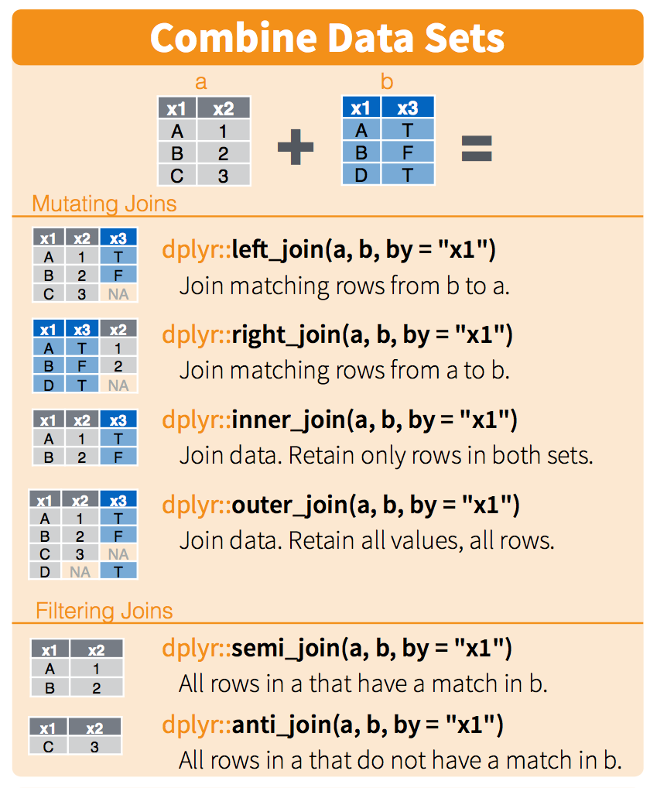

```{r setup, include = FALSE}
knitr::opts_knit$set(root.dir = "new_fec_data/")
knitr::opts_chunk$set(echo = FALSE)
```


Goal
========================================================

Understand why munging data is required and the implications it has.


What is it?
========================================================

<big>Data munging or data wrangling is the process of manually converting data from one "raw" form into another format that allows for more convenient consumption of the data.</big>


The hidden aspect of Analytics
========================================================

Predictive Analytics requires

1. Data Persistence to house data
2. Data Science to correctly answer questions
3. Data Products to visualize and consume results
4. Data Munging so that all the above are possible


Why, you ask?
========================================================

- Data NEVER comes in the CORRECT format
- Data was collected for a DIFFERENT purpose
- Data comes from DISPERATE places
- Data CHANGES over time
- Data always has ERRORS in it


Data Janitor, the unsung hero of Data Science
========================================================

This takes up roughly 80% of time/effort

You could double your time spent on analytics by reducing time on cleaning by only a quarter!


Pipes (brief detour)
========================================================

- It is easier to munge data if we think in steps
- Using the pipe (%>%) construct helps
- Allows for left-to-right (not from the inside and out)
- make it easy to add steps anywhere in the sequence


Which is more readable
========================================================


```{r, echo = FALSE}
bop_on(scoop_up(hop_through(foo_foo, forest), field_mouse), head)
```

or


```{r, echo = FALSE}
foo_foo %>%
  hop_through(forest) %>%
  scoop_up(field_mouse) %>%
  bop_on(head)
```


Setup
========================================================


```{r, echo = FALSE}
options(stringsAsFactors = FALSE)
library(dplyr)
library(lubridate)
library(purrr)
library(ggplot2)
library(stringr)
library(assertr)
```


Where do we start?
========================================================

Always start with a question!

Which presidential candidate made more money?


The Data
========================================================


The real view
========================================================


What does any of it mean
========================================================


Load Individual Donations
========================================================

It took a fair amount of work to get the args right to import this.

```{r}
'itcont.txt' %>%
  read.csv(sep = '|', quote = "", 
           header = F, skipNul = T, na.strings = '') -> ind
```


The data has no names
========================================================

Talk about why we would want to create a pipeable function to do this.

```{r}
names(ind) <- names(read.csv('indiv_header_file.csv'))
```


Select
========================================================
Decrease the width of your data
We only care about a smaller set of the data

```{r}
ind %>% 
  select(CMTE_ID, TRANSACTION_TP, ENTITY_TP, 
         TRANSACTION_DT, TRANSACTION_AMT) -> ind
```


Lets actually look at our data
========================================================
Just becuase we read it with success does not mean it is correct


Date is not really date
========================================================

```{r}
str(ind)
```


Mutate to the Rescue
========================================================


```{r}
ind %>%
  mutate(date = as.Date(mdy(TRANSACTION_DT))) %>%
  select(-TRANSACTION_DT) -> ind
```


Back to the Future (Sanity Check)
========================================================

```{r}
ind %>% 
  verify(date < as.Date(mdy('10202016'))) -> ind

# Theres not many, and its clear that some are just typos.
ind %>%
  filter(date > as.Date(mdy('10202016')))

# Lets just remove them
ind %>%
  filter(date < as.Date(mdy('10202016'))) %>%
  verify(date < as.Date(mdy('10202016'))) -> ind
```


Filter
========================================================
Decrease the height of your data

```{r}
ind %>% 
  filter(TRANSACTION_TP == '15') %>% 
  select(-TRANSACTION_TP) -> ind
```


```{r}
ind %>% 
  filter(ENTITY_TP %in% c('IND', 'CAN')) %>% 
  select(-ENTITY_TP) -> ind
```


```{r, eval = FALSE}
save(ind, file = 'ind.Rdata')
load('ind.Rdata')
```


The process
========================================================

- Load Data
- Give it correct names
- Select fields (columns) we need
- Filter rows (observations) that are relevant
- Rinse and repeat for other data sets


Remove code noise
========================================================

```{r}
add_names <- function(df, file) {
  names(df) <- names(read.csv(file))
  df
}
read_fec <- function(file) {
  read.csv(file, sep = '|', skipNul = T, na.strings = '', 
           header = F, quote = "")
}
```


Candidate Data
========================================================


```{r}
'cn.txt' %>%
  read_fec %>% 
  add_names('cn_header_file.csv') %>%
  select(CAND_ID, CAND_NAME, CAND_ELECTION_YR, CAND_OFFICE) -> cand
```

Only want Pres
```{r}
cand %>%
  filter(CAND_OFFICE == 'P') %>%
  select(-CAND_OFFICE) -> cand
```

Only want this election
```{r}
cand %>%
  filter(CAND_ELECTION_YR == '2016') %>%
  select(-CAND_ELECTION_YR) -> cand
```


```{r, echo = FALSE}
cand$CAND_NAME %>%
  recode("PERRY, JAMES R (RICK)" = "PERRY, JAMES R") %>%
  recode("CARSON, BENJAMIN S SR MD" = "CARSON, BENJAMIN S") %>%
  recode("CRUZ, RAFAEL EDWARD \"TED\"" = "CRUZ, RAFAEL EDWARD") %>%
  recode("SKEWES, PETER ALAN PH.D." = "SKEWES, PETER ALAN") %>%
  recode("DE  LA  FUENTE, ROQUE ROCKY" = "DE LA FUENTE, ROQUE ROCKY") %>%
  recode("GILMORE, JAMES S III" = "GILMORE, JAMES S") %>%
  recode("CHAFEE, LINCOLN DAVENPORT MR." = "CHAFEE, LINCOLN DAVENPORT") %>%
  recode("WILLIAM BILL WELD, GARY JOHNSON /" = "JOHNSON, GARY / WILLIAM BILL WELD, ") %>%
  recode("MCMULLIN / NATHAN DANIEL, EVAN JOHNSON" = "MCMULLIN, EVAN / NATHAN DANIEL, JOHNSON") -> cand$CAND_NAME

```


Link Data
========================================================


```{r}
'ccl.txt' %>%
  read_fec %>%
  add_names('ccl_header_file.csv') %>%
  select(CAND_ID, CMTE_ID) -> link
```


It would be great to a network here about how each field links to each table!


Joins
========================================================

How do we turn three data sets into one?



Joins
========================================================

This will increase the width of the data


Joins
========================================================


```{r}
link %>% 
  inner_join(cand, by = c("CAND_ID")) -> df
```


```{r}
df %>% 
  left_join(ind, by = "CMTE_ID") -> df
```


Cleanup
========================================================


```{r}
df %>% 
  select(-CAND_ID, -CMTE_ID) -> df
```


Missing Values
========================================================


```{r}
df %>% filter(!is.na(TRANSACTION_AMT), !is.na(date)) -> df
```


Too verbose
========================================================


```{r}
df %>% 
  rename(name = CAND_NAME, 
         amount = TRANSACTION_AMT) -> df
```


Names look pretty rough
========================================================


Some have running mate
```{r}
df$name %>%
  str_split(" / ") %>% 
  map_chr(~ .[[1]]) -> df$name
```

All have wrong order
```{r}
df$name %>%
  str_split(", ") %>% 
  map_chr(~ paste(.[[2]], .[[1]])) -> df$name
```


Capital Letters feel like they are yelling at me
```{r}

df$name %>% tolower -> df$name
simpleCap <- function(x) {
  s <- strsplit(x, " ")[[1]]
  paste(toupper(substring(s, 1,1)), substring(s, 2),
      sep="", collapse=" ")
}


df %>%
  slice_rows('name') %>%
  by_slice(dmap, simpleCap, name) -> df$name2

simpleCap(unique(tolower(df$name[1])))


#df$name %>% unique %>% map_chr(~ simpleCap)
```


Who?
========================================================


```{r}
df %>% 
  group_by(name) %>% 
  summarise(obs = n()) -> popular

```

Who?
========================================================

```{r}
popular %>% top_n(10, obs) %>% arrange(-obs) -> most_popular
```


Not Everybody
========================================================


```{r}
df %>% 
  semi_join(most_popular, by = 'name') -> df
```

```
          name amount       date
1 BARACK OBAMA   5000 2011-11-19
2 BARACK OBAMA    500 2011-10-04
3 BARACK OBAMA  30800 2011-12-31
4 BARACK OBAMA  10000 2011-10-26
5 BARACK OBAMA  10000 2011-11-22
6 BARACK OBAMA    250 2011-11-03
```


From average people
========================================================

May want to make this smaller.
```{r}
df %>% 
  filter(abs(amount) < 100000) -> df
```

```
          name amount       date
1 BARACK OBAMA   5000 2011-11-19
2 BARACK OBAMA    500 2011-10-04
3 BARACK OBAMA  30800 2011-12-31
4 BARACK OBAMA  10000 2011-10-26
5 BARACK OBAMA  10000 2011-11-22
6 BARACK OBAMA    250 2011-11-03
```

Aggregations
========================================================


```{r}
df %>% 
  group_by(name, date) %>%
  summarise(total = sum(amount)) -> df
```

```
Source: local data frame [6 x 3]
Groups: name

          name       date   total
         (chr)     (date)   (int)
1 BARACK OBAMA 2011-04-04 1194427
2 BARACK OBAMA 2011-04-05  822770
3 BARACK OBAMA 2011-04-06  919561
4 BARACK OBAMA 2011-04-07  823532
5 BARACK OBAMA 2011-04-08 1168861
6 BARACK OBAMA 2011-04-09  228749
```


Add in missing days
========================================================


```{r}
allDates <- 
  data.frame(date = as.Date(min(df$date) : max(df$date), 
                            origin = origin))

df %>% 
  split(.$name) %>%
  map( ~ full_join(., cbind(allDates, name = .$name[1]), 
                   by = c("name", "date"))) %>%
  bind_rows %>%
  arrange(name, date) -> df
```

```
Source: local data frame [6 x 3]

          name       date total
         (chr)     (date) (int)
1 BARACK OBAMA 2008-03-27    NA
2 BARACK OBAMA 2008-03-28    NA
3 BARACK OBAMA 2008-03-29    NA
4 BARACK OBAMA 2008-03-30    NA
5 BARACK OBAMA 2008-03-31    NA
6 BARACK OBAMA 2008-04-01    NA
```


Zero 
========================================================


```{r}
df$total <- ifelse(is.na(df$total), 0, df$total)
```

```
Source: local data frame [6 x 3]

          name       date total
         (chr)     (date) (dbl)
1 BARACK OBAMA 2008-03-27     0
2 BARACK OBAMA 2008-03-28     0
3 BARACK OBAMA 2008-03-29     0
4 BARACK OBAMA 2008-03-30     0
5 BARACK OBAMA 2008-03-31     0
6 BARACK OBAMA 2008-04-01     0
```

Order them
========================================================


```{r}
df %>% 
  arrange(name, date) -> df
```

```
Source: local data frame [6 x 3]

          name       date total
         (chr)     (date) (dbl)
1 BARACK OBAMA 2008-03-27     0
2 BARACK OBAMA 2008-03-28     0
3 BARACK OBAMA 2008-03-29     0
4 BARACK OBAMA 2008-03-30     0
5 BARACK OBAMA 2008-03-31     0
6 BARACK OBAMA 2008-04-01     0
```


Running total
========================================================


```{r}
df %>% 
  group_by(name) %>%
  mutate(cum_tot = cumsum(total)) -> tot
```

```
Source: local data frame [6 x 4]
Groups: name

          name       date total cum_tot
         (chr)     (date) (dbl)   (dbl)
1 BARACK OBAMA 2008-03-27     0       0
2 BARACK OBAMA 2008-03-28     0       0
3 BARACK OBAMA 2008-03-29     0       0
4 BARACK OBAMA 2008-03-30     0       0
5 BARACK OBAMA 2008-03-31     0       0
6 BARACK OBAMA 2008-04-01     0       0
```


Result
========================================================


```{r}
tot %>% 
  mutate(cum_tot = cum_tot / 1000000) %>%
  ggplot(aes(x = date, y = cum_tot, 
             color = name, group = name)) +
  geom_line() + labs(x = "Date", y = 'Millions of $',
                     title = 'Total Contributions')
```


Total Money
========================================================


```{r}
tot %>% 
  group_by(name) %>%
  summarise(max = max(cum_tot)) %>%
  arrange(desc(max)) -> totals
```

```
Source: local data frame [10 x 2]

                   name       max
                  (chr)     (dbl)
1    MITT / RYAN ROMNEY 632468656
2          BARACK OBAMA 541859246
3  JAMES R (RICK) PERRY  18817834
4              RON PAUL  14998597
5         NEWT GINGRICH  10317229
6   RICHARD J. SANTORUM   8875965
7           HERMAN CAIN   6548949
8      TIMOTHY PAWLENTY   5057130
9          JON HUNTSMAN   3145329
10    GARY EARL JOHNSON   1202470
```


Modified Result
========================================================


```{r}
tot %>% 
  anti_join(totals %>% top_n(1, max), by = 'name') %>%
  ungroup %>%
  mutate(cum_tot = cum_tot / 1000000) %>%
  ggplot(aes(x = date, y = cum_tot, 
             color = name, group = name)) +
  geom_line() + labs(x = "Date", y = 'Millions of $',
                     title = 'Total Contributions')
```


```{r}
tot %>% 
  inner_join(data.frame(name = c('HILLARY RODHAM CLINTON', 
                                'DONALD J. TRUMP')), by = 'name') %>%
  mutate(cum_tot = cum_tot / 1000000) %>%
  ggplot(aes(x = date, y = cum_tot, 
             color = name, group = name)) +
  geom_line() + labs(x = "Date", y = 'Millions of $',
                     title = 'Total Contributions')
```


```{r}
tot[tot$name == 'DONALD J. TRUMP', ] -> tr
tr <- tr[-c(1:500), ]
plot(tr$date, tr$cum_tot)
```


What did we answer
========================================================

We changed the question quite a bit.

Which presidential candidate made more money?

Of the popular candidates in the 2012 Presidential Election, who received the most contributions from average people using observations that made temporal sense.

For some definition of the words popular and average.
