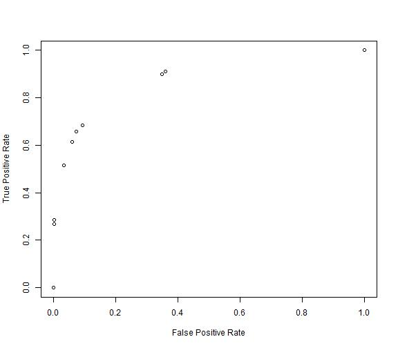

Speeding up R Functions
=================================================
  
This is my first blog post.  I have two intentions with creating this blog.  I recently read that you should take some of your weaknesses and devote more to them in order to get better.  I think I could work on documentation, presentation, and commenting my code. I think that this blog gives me some room to work on all three.  It forces me to write some documentation around the various things that I find interesting, while also forcing me to think about how to present information and make it useful to others.  In doing this I will also force to work on better commenting.  The second reason is to use it more as a reference, if I learn something useful or do something interesting it seems this is a great way to catalog it for myself. 

Sometimes writing code in a matrix based language can be awkward.  There can be situations where you have to write code in a vectorized manner for it to be efficient.  This makes it look different and forces you to think differently.  In this post I want to present an example of vectorizing code useful to data mining and how much better performs.  I also want to take a naive look into the somewhat newer compiler package in R.


```r
library(rbenchmark)
library(rpart)
library(compiler)

# Useful for data imports.
options(stringsAsFactors = FALSE)

# Useful function for getting an average time.
timer <- function(fun, iters, ...) {
    system.time(for (n in seq(iters)) fun(...))[3]/iters
}
```


Model Development
---------------------------------------------
  
The data used here is referred to as the [adult data](http://archive.ics.uci.edu/ml/datasets/Adult). It is a common data set used for bench-marking  machine learning algorithms.  Commas were added to make it a csv. It is a binary decsion problem, you have lots of indpendent variables and want to train a model to predict the dependent variable which can have one of only two outcomes.  R offers a variaty of methods to train a model to make predictions of this type. I am going to use the rpart package in order to build a decision tree to solve this problem.  


```r
adult.train <- read.csv("../../data/adulttrain.csv", na.strings = "?")

# Change dichotomous dependent variable to binary.
adult.train$y <- as.character(adult.train$y)
adult.train$y <- ifelse(adult.train$y == "<=50K", 0, 1)

# Set random seed to make repeatable.
set.seed(2)

# Number of observations in training set.
size <- nrow(adult.train)
n <- ceiling(size * 0.75)
z <- sample(size)

# Partition to train and test set.
train <- adult.train[z[1:n], ]
test <- adult.train[z[(n + 1):size], ]

# Create decision tree model on training set.
rmod <- rpart(factor(y) ~ ., train, control = rpart.control(minsplit = 2, cp = 5e-04))
# Prune the tree to reduce overfit.
rmod <- prune(rmod, cp = 0.0011)

# Evaluate model on test set.
pred <- predict(rmod, newdata = test, type = "prob")[, 2]

# Simple check of accuracy.
value <- ifelse(pred > 0.5, 1, 0)
accuracy <- sum(test$y == value)/length(value)
```


The accuracy is a very simple method to determine the quality of the models predictions on data the model was not trained on. There are a lot of things that the accuracy cannot tell us though. Many real world problems weigh one outcome higher than another. For instance in mediccal diagnosis a false negative, saying something is not cancer when it is can have severe results, you may not care that the accuracy is high becuase you pick most of the negative cases correctly. If there are only five percent true you could get 95% by picking all false. When it comes to mortgages te opposite is true, you do not want a false positive, giving a mortgage that is unlikly to be paid back (at least in theory). These determine the how well model work given these influences we need to construct some new scoring mechanisms.

Methods under consideration
------------------------------------------
### Version 1: Naive Looping Approach 
  
Most methods of evaluating how good a supervised model work depend on four parameters; 
* Number of true positives
* Number of true negatives
* Number of false positives 
* Number of false negatives  

The following function does this in a straightforward way.  This is how a lot of programmers coming from an imperitve background would approach this task. It is also very logical, when thinking through how to solve this problem you would probably end up with something similar.  


```r
params1 <- function(act, pred, cutoff = 0.5) {
    pred <- ifelse(pred > cutoff, 1, 0)
    tp <- 0
    tn <- 0
    fp <- 0
    fn <- 0
    for (i in 1:length(pred)) {
        if (act[i] == 1 && pred[i] == 1) {
            tp <- tp + 1
        } else if (act[i] == 0 && pred[i] == 0) {
            tn <- tn + 1
        } else if (act[i] == 1 && pred[i] == 0) {
            fn <- fn + 1
        } else if (act[i] == 0 && pred[i] == 1) {
            fp <- fp + 1
        }
    }
    return(list(tp = tp, fp = fp, fn = fn, tn = tn))
}

# Look at how well we did.
tmp <- params1(test$y, pred)
accuracy2 <- (tmp$tp + tmp$tn)/(tmp$tp + tmp$tn + tmp$fp + tmp$fn)

# Sanity check.
accuracy == accuracy2
```

```
## [1] TRUE
```


Create a function to calculate the ROC (receiver operating curve). This will allow us to determine how much better than random guessing our model is performing.  There are a lot of things that can be improved in both of these functions and we will look at some of them in the later sections.


```r
roc1 <- function(act, pred, gran = 0.1) {
    s1 <- rep(NA, (1/gran) + 1)
    s2 <- rep(NA, (1/gran) + 1)
    j <- 1
    for (i in seq(0, 1, gran)) {
        x <- params1(act, pred, cutoff = i)
        s1[j] <- (x$tp/(x$tp + x$fn))
        s2[j] <- (x$fp/(x$fp + x$tn))
        j <- j + 1
    }
    return(cbind(s2, s1))
}
```


One thing that you can see here is that these loops become rather verbose.  There are doing a lot of increment operations happening, set a variable equal to one plus itself.  It would be cleaner if there was a ++ increment operation like most other imperative languages. Some of the reasons there is no increment (decrement) operator in R is a side effect of it being an interpreted language.  For loops are slow in these languages so it is not advised to use loops approaches where increment operation usually reside.  Next we can look at how slow they actually are.


```r
r <- roc1(test$y, pred)
```


```r
plot(r[, 1], r[, 2], ann = FALSE)
title(xlab = "False Positive Rate", ylab = "True Positive Rate")
```

 


```r
# How long does this take?
system.time(roc1(train$y, pred, gran = 0.1))
```

```
##    user  system elapsed 
##    0.54    0.00    0.54
```

```r
system.time(roc1(train$y, pred, gran = 0.01))
```

```
##    user  system elapsed 
##    5.11    0.00    5.13
```

```r

# Kind of slow, but lets get a better estimate.
Time10a <- timer(roc1, 10, train$y, pred, gran = 0.1)
Time100a <- timer(roc1, 10, train$y, pred, gran = 0.01)
# I don't want to wait for this one to go through a loop.
Time1000a <- system.time(roc1(train$y, pred, gran = 0.001))[3]
```


Not a rigorous asymptotic analysis but we can see that there is almost a 10x jump from 0.557 to 5.1. A 100x gives 50.87, which still seems to be linear still.

Can we make this faster? Neither function follows all the idioms for fast R code. The roc function does pre-allocate s1 and s2, but it falls short by having a for loop and using cbind instead of pre-allocation.  This loop is small though, and the cbind only happens once.  Calls to cbind (or rbind) can be expensive if it is done in a loop, and loops are expensive in general. I have a good guess as to what is making it slow.  Maybe I will use some actual profiling to determine where the hot spots are. Let's revise the heart of the roc function though, params1.  Basically all it does is call params1, so let's start there. Nothing is growing or being appended, but there is alone big for loop. It is being used to sum the type of each observation. Let's vectorize this.

### Version 2: Vectorized Operations


```r
tpos <- params1(test$y, pred, 0.5)$tp
# We have 3490 true positives at a cutoff of .5.  These are the actual
# predicted classes with that threshold.
binPred <- ifelse(pred > 0.5, 1, 0)
acc1 <- sum(test$y == binPred)/length(binPred)
# We did this calculation earlier which found all cases were the actual
# was equal to the predicted in a vectorized manner.  We can take a
# similar action on each case since they are binary.
tpos1 <- sum(test$y & binPred)
all(tpos1 == tpos)
```

```
## [1] TRUE
```


It worked, now we can apply binary negations to calculate all of the rest of the cases.  These methods should be much faster. Lets create a vectorized version of the function.


```r
params2 <- function(act, pred, cutoff = 0.5) {
    pred <- ifelse(pred > cutoff, 1, 0)
    tp <- sum(act & pred)
    tn <- sum(!act & !pred)
    fp <- sum(!act & pred)
    fn <- sum(act & !pred)
    return(list(tp = tp, fp = fp, fn = fn, tn = tn))
}

roc2 <- function(act, pred, gran = 0.1) {
    s1 <- rep(NA, (1/gran) + 1)
    s2 <- rep(NA, (1/gran) + 1)
    j <- 1
    for (i in seq(0, 1, gran)) {
        x <- params2(act, pred, cutoff = i)
        s1[j] <- (x$tp/(x$tp + x$fn))
        s2[j] <- (x$fp/(x$fp + x$tn))
        j <- j + 1
    }
    return(cbind(s2, s1))
}

# How long does this take
system.time(roc2(test$y, pred, gran = 0.1))
```

```
##    user  system elapsed 
##    0.06    0.00    0.06
```

```r
system.time(roc2(test$y, pred, gran = 0.01))
```

```
##    user  system elapsed 
##     0.5     0.0     0.5
```

```r
# It already seems much faster
Time10b <- timer(roc2, 10, test$y, pred, gran = 0.1)
Time100b <- timer(roc2, 10, test$y, pred, gran = 0.01)

# It looks like we have a 10x gain in speed
Time1000b <- system.time(roc2(test$y, pred, gran = 0.001))[3]
```


This took 0.056, 0.519 and 5.18 for the ten, one hundred, and one thousand iteration version respectively.

Yep, now our for loop in roc could be hindering us.  This is a fairly short loop and we will overlook it here. This code is odd though, especially if you are not used to R, or don't come from a Matlab/octave background.  This can be very non-intuitive for anyone coming from something like C++ or java and are using R for modeling purposes.  It can also be weird for those new to R but coming from a background like SAS (without using IML).

### Version 3: Compiled Function

The compiler library which is newer to the R framework may help. It could allow you to write code that is not vectorized but still get speed improvements.


```r
params3 <- cmpfun(params1)

roc3 <- function(act, pred, gran = 0.1) {
    s1 <- rep(NA, (1/gran) + 1)
    s2 <- rep(NA, (1/gran) + 1)
    j <- 1
    for (i in seq(0, 1, gran)) {
        x <- params3(act, pred, cutoff = i)
        s1[j] <- (x$tp/(x$tp + x$fn))
        s2[j] <- (x$fp/(x$fp + x$tn))
        j <- j + 1
    }
    return(cbind(s2, s1))
}
```


You can try compiling the roc function as well but it provides very improvement. This is pretty interesting.  We did not have to rewrite anything.  We just compiled the function.  This can help those not used to thinking in terms of vectorization, the cases where it is not easy or impossible to vectorize, and in some cases vectorized code takes a little longer to understand.

Is it any faster though?  We need to see how long it takes before we can say it has any merit.


```r
system.time(roc3(test$y, pred, gran = 0.1))
```

```
##    user  system elapsed 
##    0.17    0.00    0.18
```

```r
system.time(roc3(test$y, pred, gran = 0.01))
```

```
##    user  system elapsed 
##     1.7     0.0     1.7
```

```r

# It already seems much faster than the looping method.
Time10c <- timer(roc3, 10, test$y, pred, gran = 0.1)
Time100c <- timer(roc3, 10, test$y, pred, gran = 0.01)
Time1000c <- system.time(roc3(test$y, pred, gran = 0.001))[3]
```


This took 0.186, 1.706 and 16.88 for the ten, one hundred, and one thousand iterations respectively. It looks like we have almost 3x gain in speed, than the baseline method, but still slower than the vectorized version. I am sure that this will be improved over time as the functionality is fairly new.  Java was thought to be slow 15 years ago but continual work on its byte code compiler has led to a lot of improvements, so much so that it is now considered to be fast.  So these same improvements could start to appear in R in the future giving further speed improvements.

### Version 4: Compiling the Vectorized Version


```r
# Can we compile the vectorized for speed improvement?
params4 <- cmpfun(params2)

roc4 <- function(act, pred, gran = 0.1) {
    s1 <- rep(NA, (1/gran) + 1)
    s2 <- rep(NA, (1/gran) + 1)
    j <- 1
    for (i in seq(0, 1, gran)) {
        x <- params4(act, pred, cutoff = i)
        s1[j] <- (x$tp/(x$tp + x$fn))
        s2[j] <- (x$fp/(x$fp + x$tn))
        j <- j + 1
    }
    return(cbind(s2, s1))
}

# How long does this take
system.time(roc4(test$y, pred, gran = 0.1))
```

```
##    user  system elapsed 
##    0.05    0.00    0.05
```

```r
system.time(roc4(test$y, pred, gran = 0.01))
```

```
##    user  system elapsed 
##    0.53    0.00    0.54
```

```r

Time10d <- timer(roc4, 10, test$y, pred, gran = 0.1)
Time100d <- timer(roc4, 10, test$y, pred, gran = 0.01)
Time1000d <- system.time(roc4(test$y, pred, gran = 0.001))[3]
```


### Results

Below is the final table.  We can see that we don't get any additional improvements from compiling the vectorized version.  Well I lied a bit, two are better and one is worse. More runs would give more accurate results. There could be other improvements to each case. I could compile/vectorize the roc functions respectively.  There could more places for pre-allocation.  There could also be better methods for vectorizing; it would be interesting if there was a way to vectorize the [tp, tn, fn, tp] all in one.  There are also some additional features of the compiler that may add some improvements like the enableJIT() which may help. Before looking into these types of things though it may be useful to explore some of the profiling mechanisms in R. This way we can know which areas are the most in need of work.  Effort can then be focused on making the biggest impacts.


```r
lst <- c(Time10a, Time100a, Time1000a, Time10b, Time100b, Time1000b, Time10c, 
    Time100c, Time1000c, Time10d, Time100d, Time1000d)

times <- matrix(lst, nrow = 3, ncol = 4, byrow = FALSE, dimnames = list(c("10 Iters", 
    "100 Iters", "1000 Iters"), c("Baseline", "Vectorized", "Compiled", "Vect + Comp")))
times
```

```
##            Baseline Vectorized Compiled Vect + Comp
## 10 Iters      0.557      0.056    0.186       0.054
## 100 Iters     5.100      0.519    1.706       0.530
## 1000 Iters   50.870      5.180   16.880       5.240
```

```r


benchmark(roc1(test$y, pred, gran = 0.1), roc2(test$y, pred, gran = 0.1), roc3(test$y, 
    pred, gran = 0.1), roc4(test$y, pred, gran = 0.1))
```

```
##                             test replications elapsed relative user.self
## 1 roc1(test$y, pred, gran = 0.1)          100   52.02    9.223     51.97
## 2 roc2(test$y, pred, gran = 0.1)          100    5.66    1.004      5.66
## 3 roc3(test$y, pred, gran = 0.1)          100   19.12    3.390     19.11
## 4 roc4(test$y, pred, gran = 0.1)          100    5.64    1.000      5.64
##   sys.self user.child sys.child
## 1        0         NA        NA
## 2        0         NA        NA
## 3        0         NA        NA
## 4        0         NA        NA
```

