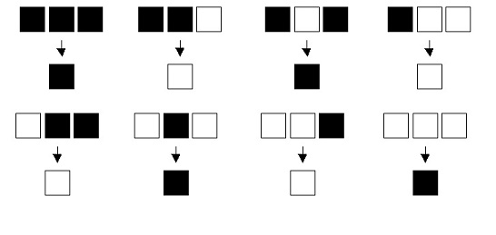
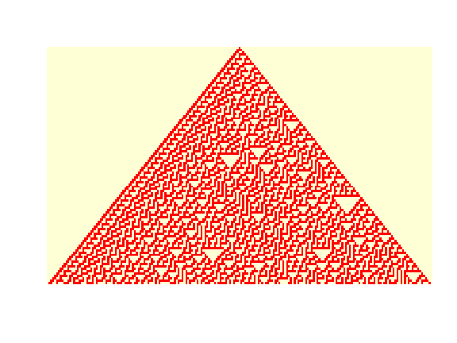
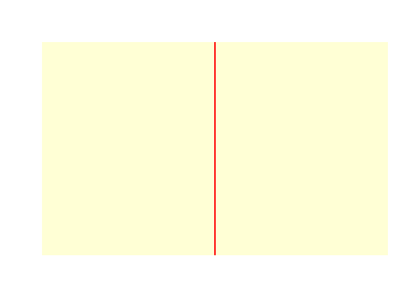
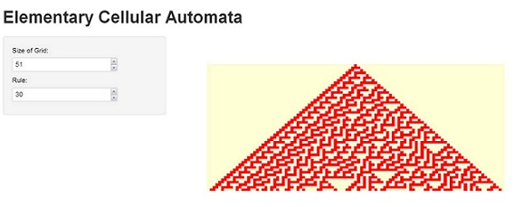

Try Out Shiny
========================================================

I create an application of Elementary Cellular Automaton from Stephen Wolfram's book A New Kind of Science a while back.  This was done using the Manipulate package.  It allows you to have a very simple interactive interface within the RStudio IDE. 


A little background before we dive in may be useful if you are not familiar with this concept.  The premise is that we have a two dimensional grid, each cell can be in one of two states, on or off.  The top row is initialized with the center cell being on and all other cells being off.  The state of each cell in a row is determined by the state of the cells in the row directly above that row. A given cell determines its state by looing at the the cell directly above it and the diagonal to it. Thus it is dependent on three cells. Since each of these three cells can be in one of two states, we have 2 to third power number of permutations or eight ways this child can determine its state based on its three parents. If we take each of these eight permutations as being able to define the alive or dead state of the child we end up will 2 raised to eight power of permutations or 256 different rules we can define. Each of these rules leads to very different outcomes. Below you can see one of these 256 sets of rules.



Now just imagine that for every child here we could have every combination of alive and dead for each of the eight outcomes. Now we shall proceed to construct an image for this model.

To do this we need to create a few functions that will handle the computations required. First we create function that will capture the state of a child's parents, it will determine the sequence of those three cells it is dependent upon and return a value of one to eight. We then compile this function to make it faster, about 3x to 5x faster.


```r
cellEval <- function(parents) {
    if (all(parents == c(1, 1, 1))) {
        child <- 1
    } else if (all(parents == c(1, 1, 0))) {
        child <- 2
    } else if (all(parents == c(1, 0, 1))) {
        child <- 3
    } else if (all(parents == c(1, 0, 0))) {
        child <- 4
    } else if (all(parents == c(0, 1, 1))) {
        child <- 5
    } else if (all(parents == c(0, 1, 0))) {
        child <- 6
    } else if (all(parents == c(0, 0, 1))) {
        child <- 7
    } else if (all(parents == c(0, 0, 0))) {
        child <- 8
    }
    return(child)
}
require(compiler, quietly = T)
# Compile this functon for speed.
ccEval <- cmpfun(cellEval)
```


Next we need to define a grid and apply this function to each cell below the first row. We need to pass this function a rule, what to assign the child based on the parents and a size for the grid. The rule here is just an integer, similar to how an integer is represented in binary.
* 00000000 -> 1
* 00000001 -> 2
* 00000010 -> 3
*   ...
* 11111111 -> 256

So this integer will be broken back down into the child state.  We also force the lenght of a row to be odd so that we have a center cell.  We construct the grid by using a matrix with the size argument as the hieght and the length of the row is this doubled and made odd. We then set the midpoint of the first row to one. We also transform the rule to binary as mentioned above. You can investigate the internals of this function but the purpose here is to explore the interface so I will leave this to the reader.

You may notice the cmpfun function as well, this is used to compile functions. If you take a look a my previous post you will see some discussion of vectorizing and compiling, namely that using for loops is bad and you should vectorize when feasible.  The problem here is that it is hard to vectorize problems that are sequential, we dont have a full vector at the begining. Vectorization is hard when you the things are sequentially dependent.  For loops are slow, very slow, and we can't easily vectorize this so to get some speedup we can compile these functions.


```r
cellAut <- function(rule, size = 101) {
    x1 <- size * 2 + 1
    grid <- matrix(0, nrow = x1, ncol = size, byrow = FALSE)
    
    mid <- ceiling(x1/2)
    grid[mid, 1] <- 1
    d <- rev(sapply(rule, function(x) {
        as.integer(intToBits(x))
    })[1:8])
    
    val <- mid + x1 - 2
    for (x in val:length(grid)) {
        grid[x] <- d[ccEval(grid[(x - (x1 + 1)):(x - (x1 - 1))])]
    }
    grid <- grid[, ncol(grid):1]
    image(1 - grid, axes = F)
}
cAut <- cmpfun(cellAut)
```


Below is one of the more interesting rules, Rule 30. It demonstrates that given a very small set of simple rules complixity can still arise. Even though the rules are deterministic it is hard to say what will happen a few rows down without actually going through each step. You can also see very dramatic changes by changing the the rules becuase the folloing Rule 100 is very boring.


```r
cAut(30, 101)
```

 


```r
cAut(100, 101)
```

 


If you load the manipulate package you can explore these rules interactivly by running the following code.


```r
require(manipulate)
manipulate(cAut(Rule, Size), Rule = slider(1, 256), Size = slider(11, 201))
```

            
I want to try to use Shiny to have this same interface in the browser. After reading parts of the wonderful [tutorial](http://rstudio.github.io/shiny/tutorial/) it seemed that it would take very lttle to do this. The only things I needed to do was to create ui.R and server.R files. The above code for the cellEval (ccEval) an cellAut (cAut) functions needs to be visible as well. This can be done by these functions in the workspace, sourcing the file with this code, or adding it into the server.R file. The code below assumes they are in the workspace. This is cleaner for the post but probably the least robust.

First lets see the contents of the ui.R file. 

```r
shinyUI(pageWithSidebar(
  # Application title
  headerPanel("Elementary Cellular Automata"),
  
  # Sidebar with a slider input for number of observations
  sidebarPanel(
    numericInput("size", "Size of Grid:", 51),
    numericInput("rule", "Rule:", 30)
  ),
  
  # Show a plot of the generated distribution
  mainPanel(
    plotOutput("CAPlot")
  )
))
```

Basically all that is happening here is that we are using the shinyUI function with three parts;

* headerPanel
* sidebarPanel
* mainPanel

The headerPanel just gets a string that is displayed in the browser tab and the title on the page. The sidebarPanel just gets two numericInputs.  The arguments to these are the name that we will refer to these varaibles as in the server.R code, the text displayed to inform the user what they do and an initial value.  In the maiPanel we specify that we will have a plotOutput and it comes from CAPlot.

The contents of the server.R file can be seen below.


```r
shinyServer(function(input, output) {
    output$CAPlot <- renderPlot({
        cAut(input$rule, input$size)
    })
})
```


This is even easier and more concise than the ui.R file.  We just use the shinyServer function and say the output is CAPlot, which is what we wanted in the mainPanel of the ui, is set in the renderPlot functon.  This renderPlot function just calls our cAut function with the two input values.  The reactive nature is really cool as well, any time the user changes the rule or the size the plot is automatically updated.

To make all of this work you just need to have the server.R file and the ui.R file in a directory called say test and run the following from a directory above the test directory.


```r
require(shiny)

runApp("test")
```


You can see the result below


