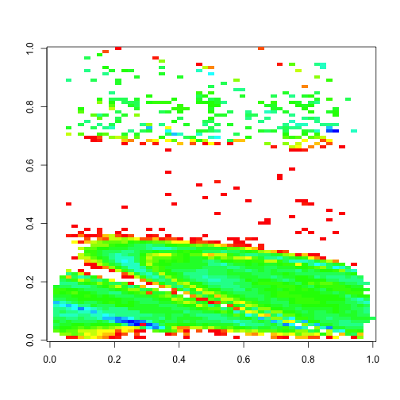

Getting Side-tracked with Basketball Data
========================================================

The NBA playoffs are here. I was interested in analyzing game data and I was able to find some from older season to be the most accessible. This is the [data](http://www.basketballgeek.com/data/) that I used. The code below will take care of downloading and importing for you though. To start with I was not really sure what I wanted to do with. It depended on what the data contained.  This set is pretty interesting in that it has a lot of shot data, who, when and most interesting where.  It has the x and y cooridinates of each shot in a game.


```r
# Load packages used.
library(rbenchmark)
library(plyr)

# This is useful for importing data.
options(stringsAsFactors = FALSE)

# Create dir for data files.
dir <- "BBdata"
dir.create(dir, showWarnings = FALSE)
temp <- tempfile()

# Location of the files.
url1 <- "http://www.basketballgeek.com/downloads/2008-2009.regular_season.zip"

# Take the base of the file name at this loaction.
file <- basename(url1)

# Download the file from the internet.
download.file(url1, file)

# Extract zipped contents to directory.
unzip(file, exdir = dir)

# The list of unzipped files.
fileList <- list.files(dir)

# Only the csv data files.
fileList <- fileList[grep(pattern = "csv", x = fileList)]

# Full location to the files.
fileList <- paste(dir, fileList, sep = "/")
```


### Method 1: rbind


I wanted to explore this data as a whole season and just create some plots with it. The zip files comes with a csv file for each game played in a seson though. I tried to load each file and append it to a growing data set. I knew this would be slow but I was in no rush. I was not aware that it would take as long as it did though.  You will see later just how slow.  

The first method I tried was to simply read each file in and append it to data frame. This is the easist soution. Wrapping this in a function is just used for benchmarking and profiling, it is an easy way to take imperative line by line instructions and call them without copy and paste.


```r
# Method which uses naive appending via rbind.
M1 <- function() {
    # Use rbind to append each file to the first.
    games <- read.csv(files[1], na.strings = "")
    # Drop first that was already loaded.
    file <- files[-1]
    # Loop over each file and append it to growing list.
    for (i in file) {
        tmpGame <- read.csv(i, na.strings = "")
        games <- rbind(games, tmpGame)
    }
    return(games)
}
files <- fileList[1:100]
system.time(games1 <- M1())[3]
```

```
## elapsed 
##   8.429
```


### Method 2: preallocation

This method is pretty bad. I may want to pull more seasons that just 2008-2009 which will make it even worse.  Most everywhere you look in relation to making something in R work faster you see vectorization for math operations and pre-allocation for data storage operations. Let’s see how much this helps with the task at hand.

First though I want to create a useful function for initializing a data frame. This is a very handy function that I made and can clean up the look of preallocationwhen dealing with wide data frames.  You don't have to be as verbose with listing out every variable. You can just give it a list of names and a number of rows and you have all o fthe preallocation taken care of.


```r
initDF <- function(name, row) {
    # String which start the data frame istantiation.
    init <- "df <- data.frame("
    for (i in name) {
        init <- paste(init, i, " = rep(NA, ", row, "), ", sep = "")
    }
    init <- substr(init, 1, nchar(init) - 2)
    init <- paste(init, ")", sep = "")
    eval(parse(text = init))
    return(df)
}

# Method which uses preallocation.
M2 <- function() {
    # Read first file to get names in the data.
    game <- read.csv(files[1], na.strings = "")
    # The number of rows in the data.
    rows <- nrow(game)
    # Its hard to know this exactly before hand so be conservative with guess.
    estRows <- ceiling(rows * length(files) * 1.2)
    # Preallocate the data frame.
    games <- initDF(names(game), estRows)
    # Initialize index.
    j <- 1
    # Loop over each file.
    for (i in files) {
        game <- read.csv(i, na.strings = "")
        # How many rows are in this data set.
        len <- nrow(game)
        # Insert these rows into there spots in the preallocated data frame.
        games[j:(j + len - 1), ] <- game
        # Increment the index
        j <- j + len
    }
    # Remove the exccess from our conservative quess.
    games <- games[1:(j - 1), ]
    return(games)
}
files <- fileList[1:100]
system.time(games2 <- M2())[3]
```

```
## elapsed 
##   6.227
```


The first thing I notice here is that I have to make a guess on the size of the data, which may not always be easy. Here I could use the results from the first method since I have already seen how many rows we will have.  To make it more realistic I used an approximation and applied a fudge factor.  The next problem is the code is odd in respect to the hoops you jump through to index correctly, to not overwrite old data or leave gaps in between appended sets.  We did save some time though, not much but it does go faster.  Was it worth it though, dealing with the indexing maze in order to gain a small speed improvement.

### Method 3: do.call rbind

It appears there has been some discussion about this type of data wrangling.  There is a better way to use rbind, via do.call.
http://r.789695.n4.nabble.com/Concatenating-data-frame-td799749.html
This gives me another method to look into. This calls rbind on the entire list instead of multiple times. We also get rid of all of the indexing mess. 


```r

# Method which uses do.call, rbind all at once.
M3 <- function() {
    # Initialize list that will store each loaded file.
    g <- vector("list", length(files))
    # Initialize the index.
    j <- 1
    # Loop over all of the files.
    for (i in files) {
        g[[j]] <- read.csv(i, na.strings = "")
        j <- j + 1
    }
    games <- do.call("rbind", g)
    return(games)
}
files <- fileList[1:100]
system.time(games3 <- M3())[3]
```

```
## elapsed 
##   1.228
```


### Method 4: plyr's rbind.fill

Two things to note about the code itself; the size has reduced from the pre-allocation method and we have no indices to maintain.  But the best outcome is the speed, a good improvement.  I could probably live with this approach but I am intrigued by another similar post and its recommendation to use rbind.fill from the plyr package.
http://r.789695.n4.nabble.com/Fast-dependable-way-to-quot-stack-together-quot-data-frames-from-a-list-td2532293.html
I have used this in the past when I have sets which may have different columns as it provides a nice feature of imputing them to missing instead of the error received from the regular rbind.  Let’s give this a try.


```r
# Method which uses plyr, references say it is the fastest approach.
M4 <- function() {
    # Initialize list that will store each loaded file.
    g <- vector("list", length(files))
    # Initialize the index.
    j <- 1
    # Loop over all of the files.
    for (i in files) {
        g[[j]] <- read.csv(i, na.strings = "")
        j <- j + 1
    }
    games <- rbind.fill(g)
    return(games)
}
files <- fileList[1:100]
system.time(games4 <- M4())[3]
```

```
## elapsed 
##    1.43
```


The code is still very clean, we basically just replaced one line.  For the case of only looking at the first 100 files it appears to be a little slower.  Let's try each method on a larger set.  We should also check that everything is working as we expect it to.

### Comparison


```r
# Time the first 200
files <- fileList[1:200]

# Run a side by side comparison of each method.
benchmark(replications = rep(1, 1), M1(), M2(), M3(), M4(), columns = c("test", 
    "replications", "elapsed"))
```

```
##   test replications elapsed
## 1 M1()            1  21.349
## 2 M2()            1  12.610
## 3 M3()            1   3.274
## 4 M4()            1   3.599
```

```r

# Check that each method works.
all(all(games1 == games2, na.rm = TRUE), all(games2 == games3, na.rm = TRUE), 
    all(games3 == games4, na.rm = TRUE))
```

```
## [1] TRUE
```


### Method 5: Recursion

Thinking through what is happening here leaves me to wonder if all of these methods are bad.  In the cases where we use indexing we are getting beat up by the copy on modify, every time we add new rows we copy the whole data frame due to immutability.  The naive rbind approach is always looking for larger sections of contiguous memory.  Thus in the beginning it is small copying every increasing sets around just keeps building up though.  The do.call and rbind.fill method seem to be very close to pre-allocation time, I want to see what they are doing under the hood though before I say anything about them.  I would imagine that a divide and conquer approach would work here.  We can use the naive rbind but never have to carry the whole data frame, actually only half one time, a quarter twice, etc., which is why it’s so slow. R deals with recursion by adding the environment to the call stack.  In a normal function you don’t worry about cleaning the local environment before you leave it because it will be destroyed when only moving the return object.  In the case of recursion though we add the whole environment to the stack then jump to the next iteration.  Do to the log nature of the divide and conquer we don't have to worry about going infinitely deep but we do have to worry about copying a lot of useless data at every new level of depth.  Let’s clean the environment except what we actually care about.


```r
# Recursive row binding, you don't carry huge sets around, has divide and
# conquer on memory usage, large set only appear at the top level of the
# recursion.
recurBind <- function(dList) {
    len <- length(dList)/2
    # Preallocate list for small improvement.
    data <- vector("list", len)
    j <- 1
    for (i in seq(len)) {
        # Merge each set of two sequential data sets together.
        data[[j]] <- rbind(dList[[(i * 2) - 1]], dList[[i * 2]])
        j <- j + 1
    }
    # In case length was odd, just add last set to the end.
    if (floor(len) != len) {
        data[[j]] <- dList[[len * 2]]
    }
    # Less data to store on the stack, tail call optimization would be nice
    # here.
    rm(dList, len, j)
    # Recursive call.
    if (length(data) > 1) {
        data <- recurBind(data)
    }
    return(data)
}

# Apply the recursive method.
M5 <- function() {
    # Initialize list that will store each loaded file.
    g <- vector("list", length(files))
    # Initialize the index.
    j <- 1
    # Loop over all of the files.
    for (i in files) {
        g[[j]] <- read.csv(i, na.strings = "")
        j <- j + 1
    }
    games <- recurBind(g)[[1]]
    return(games)
}
files <- fileList[1:100]
system.time(games5 <- M5())[3]
```

```
## elapsed 
##   1.049
```


It's faster than all the other methods, but I was actually thinking that it would be slower for this small case and would only be asymptotically faster once we take the rest of the files into consideration.  Let's run the above test again and see how good it fares.

### Comparison 2


```r
# Time the first 500
files <- fileList[1:500]

# Run a side by side comparison of each method.
benchmark(replications = rep(1, 1), M1(), M2(), M3(), M4(), M5(), columns = c("test", 
    "replications", "elapsed"))
```

```
##   test replications elapsed
## 1 M1()            1  125.85
## 2 M2()            1   79.57
## 3 M3()            1   16.13
## 4 M4()            1   19.63
## 5 M5()            1    6.49
```

```r

# Check that each method works.
all(games1 == games5, na.rm = TRUE)
```

```
## [1] TRUE
```


It seems I was right. The first two methods are performing very poorly.  We can safely ignore them from here on out. To me this is a very interesting result; we used in what is reality the slowest approach possible, rbind, in a clever manner to get the fastest approach. What if we apply some of the faster methods inside the recursion, or even get rid of the recursion altogether by smart looping in a manner that is equivalent to recursion but never has to recreate the local environment recursively.  Is there a way that we can mimic tail call optimization or even compile this?  I am sure there are even faster ways of doing this.  

### Basketball Analysis

What was all of this for again, oh yeah Basketball.


```r
files <- fileList
games <- M5()
made <- games[, c("team", "player", "etype", "result", "x", "y")]
made <- made[made$etype == "shot", ]
made <- made[made$result == "made", ]
made <- made[, c("result", "x", "y")]
made <- made[complete.cases(made), ]
made$result <- ifelse(made$result == "made", 1, 0)
x <- tapply(made$result, made[, c("x", "y")], sum)
x <- ifelse(is.na(x), 0, x)
image(log(x), col = rainbow(30))
```

 

```r

missed <- games[, c("team", "player", "etype", "result", "x", "y")]
missed <- missed[missed$etype == "shot", ]
missed <- missed[missed$result == "missed", ]
missed <- missed[, c("result", "x", "y")]
missed <- missed[complete.cases(missed), ]
missed$result <- ifelse(missed$result == "missed", 1, 0)
y <- tapply(missed$result, missed[, c("x", "y")], sum)
y <- ifelse(is.na(y), 0, x)
image(log(y), col = rainbow(30))
```

 

This code is pretty gross, it is more or less hacking to get a few plots, I realized I bacame to interested in importing the data in a fast and clean manner that I had little time to do anything with the actual data.


### Does it Scale

Just to check how good this is lets run a few years.  This adds the prior season.


```r

# Data for the year prior.
url2 <- "http://www.basketballgeek.com/downloads/2007-2008.regular_season.zip"

# Take the base of the file name at this loaction.
file2 <- basename(url2)

# Download the file from the internet.
download.file(url2, file2)

# Extract zipped contents to directory.
unzip(file2, exdir = dir)

# The list of unzipped files.
newList <- list.files(dir)

# Only the csv data files.
newList <- newList[grep(pattern = "csv", x = newList)]

# Full location to the files.
newList <- paste(dir, newList, sep = "/")

length(fileList)
```

```
## [1] 2359
```

```r
length(newList)
```

```
## [1] 2359
```

```r

# Time larger set
files <- fileList
benchmark(replications = rep(1, 1), M3(), M4(), M5(), columns = c("test", "replications", 
    "elapsed"))
```

```
##   test replications elapsed
## 1 M3()            1  360.35
## 2 M4()            1  474.80
## 3 M5()            1   57.55
```

