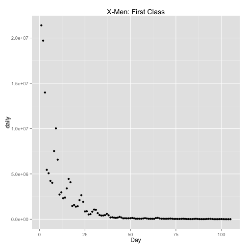
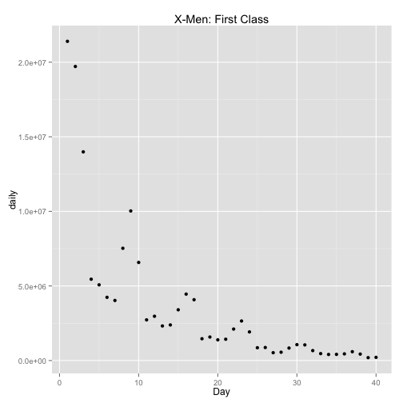
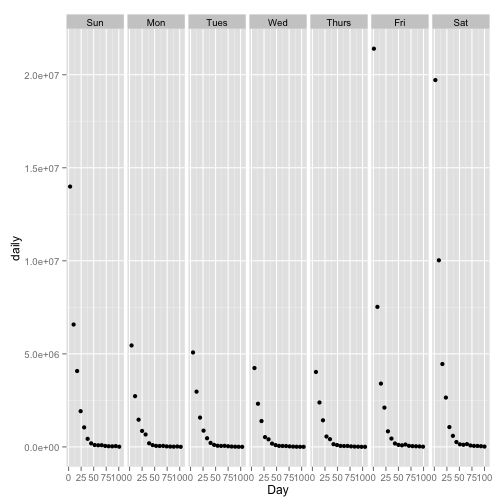

Reproduacability Made Easy
========================================================

A lot of times I think the biggest hurdle to analyzing data and investigating something interesting is getting your hands on the data. You can look at my last post to find some basketball data even thought its a bit old. Some of my interest there was based on how the season progresses. But after thinking about ranking things over time movies seemed to be a better fit. Thus my next hurdle was to try to find some data related to movies an particularly box office sales. 

There are a few other issues I have wanted to explore recently as well. I have read a lot about on types of analysis people have done and what there results are. If the area is going to latch on to the term 'data science' I think one thing that needs to be addresed is verifiabilty and reproducablitly, which are potentially the same thing but for the purpose of completness I mention both. What I mean by these are that anybody can read about the data I am using, the hypothosis I am making, the analysis employed and the results found and be able to verify that I am not full of shit.

I hope to address the problem of making data available. Another thing I find hard is keeping data up to date, to really verify my findings you should be able to run the analysis on data that is relavent. It can go stale fairly quickly if some method is not put in place to automate the process of pulling new data. The last issue is how to allow other people to reproduce the work you did. I hope to tackle all of theses issues here, maybe some more than others though.

Collect Data
-----------------

The first step of getting data is usually the hardest. This is usually the least documented as well. If you do get lucky and there is some data that you can use it is often lacking any detail as to how it was collected, when, from where and by whom. Thus any questions you have are simple forced assumptions you must make. In every data mining/data science project I've worked on this has been hard. Usually there are many hurdles you have to jump through making it a success to actually have data. Once you recieve the data it is NOT and will NEVER be in the form that would be most useful for your peurpose. I have found that collecting it myself can sometimes be the easist way to get data. This way you know all of the assumptions behind it. This does require a lot of work though and I hope the inderlying processes around data will get better so tht this in not the case.

Below you can see the my initial attempt at trying to find some movie data. The data was collected from [Box Office Mojo](http://www.boxofficemojo.com/) using the R XML package.


```r
library(XML)
library(lubridate)
# This is useful for imported data.
options(stringsAsFactors = FALSE)

# Source where data comes from.  
site <- "http://www.boxofficemojo.com/daily/chart/?view=1day&sortdate=2013-03-15&p=.htm"

# Read data from that site.
siteData <- readHTMLTable(site)

# We need to investigate this to see what we really need. Looking at the site will helps as well.
# We need to take the tenth element in this list.
mList <- readHTMLTable(site)[[10]]
# We need to remove some of the leading and trailing rows as well.
mList <- mList[4:(nrow(mList) - 1), ]
# Give the fields names.
names(mList) <- c("td", "yd", "Name", "Stu", "Daily", "peru", 
                  "perd", "num", "Avg", "Gross", "Day")
# SHow a subset of the data.
mList[14:18, ]
```

```
##    td yd        Name    Stu    Daily  peru perd num  Avg        Gross Day
## 17 14 12  Life of Pi    Fox $328,783  +80% -17% 646 $509 $120,448,917 115
## 18 15 13     Quartet  Wein. $265,313  +72% -25% 688 $386  $14,162,205  64
## 19 16 14  Dark Skies W/Dim. $188,460  +45% -52% 703 $268  $16,290,971  22
## 20 17 15 Warm Bodies   LG/S $185,718  +72% -38% 659 $282  $64,196,628  43
## 21 18 18     Emperor  RAtt. $183,452 +119% -45% 311 $590   $1,586,515   8
```


Some cleaning was already done in removing the items from the list to just get the table with the movie data, as well as removing lines from that table that are just noise. We also had to clean the names up a bit. Much more cleaning is required though. As with any data project this will fall into the 80/20 ratio of 80% of your time is spent cleaning and transforming the data into a usebale format and twenty percent is spent in doing actual analysis. All the interesting algorithms and visualizations you can use on data are not applicable until the correct amount of cleaning has happened. I often think of this task as [data wrangling](http://en.wikipedia.org/wiki/Data_wrangling) and person who is skilled in this craft as a [data ninja](http://www.techopedia.com/definition/29222/data-ninja). I don't think I have ever seen a job post for a data ninja either, but the skill is crucial.

Please don't use the above code in any loop construct to pull more data as that could create a lot of stress on the sites server, it will also take a while, I don't want it to go away, and I have made a far easier method for you to get all of the data if you keeping. If you just want the data you can use the following in R.


```r
require(devtools)
```

```
## Loading required package: devtools
```

```r
install_github("chRonos", "darrkj", quiet = TRUE)
```

```
## Installing github repo(s) chRonos/master from darrkj
```

```
## Installing chRonos.zip from
## https://github.com/darrkj/chRonos/archive/master.zip
```

```r

suppressPackageStartupMessages(library(chRonos))
data(mvData)

str(mvData)
```

```
## 'data.frame':	196252 obs. of  13 variables:
##  $ date    : Date, format: "2009-07-17" "2009-07-18" ...
##  $ td      : chr  "12" "14" "11" "11" ...
##  $ yd      : chr  "-" "12" "14" "11" ...
##  $ name    : chr  "(500) Days of Summer" "(500) Days of Summer" "(500) Days of Summer" "(500) Days of Summer" ...
##  $ studio  : chr  "FoxS" "FoxS" "FoxS" "FoxS" ...
##  $ daily   : num  263178 310203 261120 125900 141175 ...
##  $ peru    : num  NA 0.18 -0.16 -0.52 0.12 -0.04 0.01 2.65 0.26 -0.18 ...
##  $ perd    : num  NA NA NA NA NA NA NA 0.9 1.02 0.96 ...
##  $ Theaters: num  27 27 27 27 27 27 27 85 85 85 ...
##  $ Avg     : num  9747 11489 9671 4663 5229 ...
##  $ Gross   : num  263178 573381 834501 960401 1101576 ...
##  $ Day     : num  1 2 3 4 5 6 7 8 9 10 ...
##  $ weekday : Ord.factor w/ 7 levels "Sun"<"Mon"<"Tues"<..: 6 7 1 2 3 4 5 6 7 1 ...
```


Update Data
-----------------

The next issue is data falling out of relavency. If you run the above I can gaurantee that the data you have will be atleast a week old. What does stale data mean? Think about opening your favorite weather resource and it is predicting that it will rain last Tuesday. Thats useless since it does not help you to plan for your outdoor excursion tomorrow, even worse if you know it did not rain last Tuesday, now your thoughts on this source are tainted. You need to keep data up to date and relavent.

I could probably make a method to have this data up to date for whenever you pull it. I I think I may do that but for now I think this is better. Included in this package is a function called mojoRef(). This takes care of refreshing the data for you. If you run it you can see the new dates streaming in as the data is being pulled and cleaned to align with the current data frame. This can easily be appended to the rest of the data. If you wanted something to be autonomous you could add your own line to the function to ruturn nothing but overwrite the source data.

mvData <<- rbind(mvData, mojoRef())


```r
mojoRef <- function() {
    library(chRonos)
    data(mvData)
    # Start from the day after that most recent day.
    start <- max(mvData$date) + 1
    # Remove this data.
    return(mojo(start))
}

newData <- mojoRef()
```

```
## [1] "2013-05-16"
## [1] "2013-05-17"
## [1] "2013-05-18"
## [1] "2013-05-19"
## [1] "2013-05-20"
## [1] "2013-05-21"
```


What is really happening here is that we isolated what data we want, how we want it cleaned, and how that all has to happen. This is really only able to happen once your data requirements have converged. I took some time for me to figure out exactly how I wanted the date stored and cleaned. Once the aquostion part was correct then I worried about refreshing it. Donald Knuth stated that premature optimization is the root of all evil. I agree but I have an equally valid statement, premature automation is the root of all headaches. Once you really know what you want and you have some need to consume new data in a specified manner then you can automate the extraction process.


Make Data Available
-----------------

Above you saw how easy it was to get the data that I have made available on Github. I need to thank [Hadley Wickham](http://had.co.nz/) for his [devtools](https://github.com/hadley/devtools) package which makes the process to get the package easy, as well as the people at [Github](https://github.com/) for making the storage location very accesable. 

Data can be made available in other methods as well. Read my last post on basketball data to see another method employed elsewhere that made the aquisition stage easy on my part. Simply google open data and you will find a vast array of current info on this problem. If you do some work that you think is relavent you should try give others access to it. I am not saying give away trade secrets or anything. Make it open to your audience. This may be ironing out the process for your coworkers, creating internal documentation, or something similar to this post. You will know the frustrations of not doing so the first time you inherit a project where decsions where made based on some data but you have know way of validating that it still holds true. Have you ever heard of [Concept Drift](http://en.wikipedia.org/wiki/Concept_drift)?


Reproducable
-----------------

To make any analysis done on the data reproducable has been a nuance in the past. There are many papars out there that you just have to take the authers word. There are also cases where after the fact it has been shown that the results were faked, so we can't trust everyone. If we make ourselves accountable people can have no other course of action but to believe us. If not they cannot merely say somehting is false, if the process is repeatable and reproducable then they must redo your work and show where it is not, and make sure their work is reproducable. Above I have shown just one manner in which you can make data accesable, but in that process I have also given all of the code to do these things, tried to explain what I was doing and why. I will leave you with a small sample of analysis which I hope my next post will go into more depth. 


```r
# Get rid of really old data.
mov <- mvData[year(mvData$date) > 2002, ]
# Movies that have a first day.
wholeMov <- unique(mov[mov$Day == 1, ]$name)
# Create a list of movies in this set.
mov <- mov[mov$name %in% wholeMov, ]

library(ggplot2)
# Lets look at one movie.
title <- "X-Men: First Class"
movie <- mov[mov$name == title, ]
qplot(Day, daily, data = movie, main = title)
```

 

```r
# Zoom in on area of interest.
qplot(Day, daily, data = movie[1:40, ], main = title)
```

 

```r

# The day of the week seems to have a big impact on sales.  Lets break it
# out into a plot for each day.
ggplot(movie, aes(Day, daily)) + geom_point() + facet_grid(. ~ weekday)
```

 


